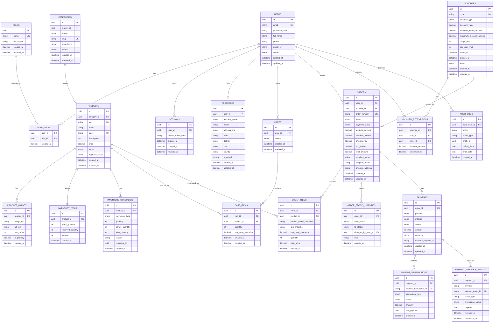

# Entity Relationship Diagram

## Fullstack E-commerce Platform with TypeScript

**Version:** 1.0  
**Project Code:** ECOM-TS  
**Document Code:** ECOM-TS_ERD_1.0.md  
**Date:** 08/06/2026  
**Main Technologies:** Nx Monorepo, Next.js, NestJS, TypeScript, Playwright  

---

## Revision History

| Date | Version | A/M/D | Description | Author |
| :--- | :--- | :---: | :--- | :--- |
| 08/06/2026 | 1.0 | A | Initial ERD document based on SRS, Use-Case Specification, and Software Design Document | Nguyen Hung Nguyen |

> A: Added; M: Modified; D: Deleted

---

## Table of Contents

1. [Overview](#1-overview)  
2. [Entity Relationship Diagram](#2-entity-relationship-diagram)  
3. [Entity Groups](#3-entity-groups)  
4. [Table Specifications](#4-table-specifications)  
5. [Relationships](#5-relationships)  
6. [Indexes and Constraints](#6-indexes-and-constraints)  
7. [Data Integrity Rules](#7-data-integrity-rules)  
8. [Appendix](#8-appendix)

---

# 1. Overview

This document defines the database design for the Fullstack E-commerce Platform with TypeScript. The data model supports authentication, product catalog, inventory management, shopping cart, checkout, order management, payment integration, vouchers, and admin audit logging.

The ERD is designed for a relational database because the system requires transactional consistency for checkout, stock deduction, order creation, and payment status updates.

## 1.1 Main Design Principles

1. Use normalized relational entities for core business data.
2. Preserve historical order data using snapshots in order items and order addresses.
3. Enforce stock safety through inventory records and movement logs.
4. Process payment webhooks idempotently using unique external event identifiers.
5. Support RBAC using roles and user-role relationships.
6. Keep admin actions traceable through audit logs.

---

# 2. Entity Relationship Diagram

---

# 3. Entity Groups

| Group | Entities | Purpose |
| :--- | :--- | :--- |
| Identity and Access | users, roles, user_roles, sessions | Authentication and authorization. |
| Customer Profile | addresses | Delivery and customer profile support. |
| Catalog | categories, products, product_images | Product browsing, search, and management. |
| Inventory | inventory_items, inventory_movements | Stock tracking and overselling prevention. |
| Cart | carts, cart_items | Customer shopping cart. |
| Promotion | vouchers, voucher_redemptions | Discount and voucher application. |
| Order | orders, order_items, order_status_histories | Checkout result and order lifecycle. |
| Payment | payments, payment_transactions, payment_webhook_events | Payment integration and webhook processing. |
| Audit | audit_logs | Admin and business action traceability. |

---

# 4. Table Specifications

## 4.1 `users`

Stores user accounts for customers and admins.

| Column | Type | Constraint | Description |
| :--- | :--- | :--- | :--- |
| id | uuid | PK | Unique user identifier. |
| email | varchar | Unique, not null | User email used for sign-in. |
| password_hash | varchar | Not null | Securely hashed password. |
| full_name | varchar | Not null | User full name. |
| phone | varchar | Nullable | User phone number. |
| avatar_url | varchar | Nullable | Profile avatar URL. |
| status | enum | Not null | active, inactive, blocked. |
| created_at | datetime | Not null | Creation timestamp. |
| updated_at | datetime | Not null | Last update timestamp. |

## 4.2 `roles`

Stores access roles.

| Column | Type | Constraint | Description |
| :--- | :--- | :--- | :--- |
| id | uuid | PK | Unique role identifier. |
| name | varchar | Unique, not null | Role name, such as customer or admin. |
| description | varchar | Nullable | Role description. |
| created_at | datetime | Not null | Creation timestamp. |
| updated_at | datetime | Not null | Last update timestamp. |

## 4.3 `user_roles`

Maps users to roles.

| Column | Type | Constraint | Description |
| :--- | :--- | :--- | :--- |
| user_id | uuid | PK, FK users.id | User identifier. |
| role_id | uuid | PK, FK roles.id | Role identifier. |
| created_at | datetime | Not null | Assignment timestamp. |

## 4.4 `sessions`

Stores refresh sessions or persistent login sessions if the implementation uses server-side session tracking.

| Column | Type | Constraint | Description |
| :--- | :--- | :--- | :--- |
| id | uuid | PK | Session identifier. |
| user_id | uuid | FK users.id | Session owner. |
| refresh_token_hash | varchar | Nullable | Hashed refresh token. |
| expires_at | datetime | Not null | Expiration timestamp. |
| created_at | datetime | Not null | Creation timestamp. |
| revoked_at | datetime | Nullable | Revocation timestamp. |

## 4.5 `addresses`

Stores reusable customer addresses.

| Column | Type | Constraint | Description |
| :--- | :--- | :--- | :--- |
| id | uuid | PK | Address identifier. |
| user_id | uuid | FK users.id | Address owner. |
| recipient_name | varchar | Not null | Delivery recipient. |
| phone | varchar | Not null | Recipient phone. |
| address_line | varchar | Not null | Street address. |
| ward | varchar | Nullable | Ward. |
| district | varchar | Nullable | District. |
| city | varchar | Not null | City or province. |
| country | varchar | Not null | Country. |
| is_default | boolean | Not null | Whether address is default. |
| created_at | datetime | Not null | Creation timestamp. |
| updated_at | datetime | Not null | Last update timestamp. |

## 4.6 `categories`

Stores product categories.

| Column | Type | Constraint | Description |
| :--- | :--- | :--- | :--- |
| id | uuid | PK | Category identifier. |
| parent_id | uuid | Nullable, FK categories.id | Parent category for nested hierarchy. |
| name | varchar | Not null | Category name. |
| slug | varchar | Unique, not null | URL-friendly category identifier. |
| description | text | Nullable | Category description. |
| status | enum | Not null | active or inactive. |
| created_at | datetime | Not null | Creation timestamp. |
| updated_at | datetime | Not null | Last update timestamp. |

## 4.7 `products`

Stores product catalog information.

| Column | Type | Constraint | Description |
| :--- | :--- | :--- | :--- |
| id | uuid | PK | Product identifier. |
| category_id | uuid | FK categories.id | Category identifier. |
| sku | varchar | Unique, not null | Stock keeping unit. |
| name | varchar | Not null | Product name. |
| slug | varchar | Unique, not null | SEO-friendly URL identifier. |
| description | text | Nullable | Product description. |
| price | decimal | Not null | Current product price. |
| status | enum | Not null | active, inactive, archived. |
| approval_status | enum | Not null | pending, approved, rejected. |
| created_at | datetime | Not null | Creation timestamp. |
| updated_at | datetime | Not null | Last update timestamp. |

## 4.8 `product_images`

Stores product image URLs.

| Column | Type | Constraint | Description |
| :--- | :--- | :--- | :--- |
| id | uuid | PK | Image identifier. |
| product_id | uuid | FK products.id | Related product. |
| image_url | varchar | Not null | Image URL. |
| alt_text | varchar | Nullable | Alternative text. |
| sort_order | integer | Not null | Display order. |
| is_primary | boolean | Not null | Primary image flag. |
| created_at | datetime | Not null | Creation timestamp. |

## 4.9 `inventory_items`

Stores current stock values for products.

| Column | Type | Constraint | Description |
| :--- | :--- | :--- | :--- |
| id | uuid | PK | Inventory identifier. |
| product_id | uuid | Unique, FK products.id | Product being tracked. |
| stock_quantity | integer | Not null | Available physical stock. |
| reserved_quantity | integer | Not null | Reserved stock, if reservation is supported. |
| version | integer | Not null | Optimistic concurrency version. |
| updated_at | datetime | Not null | Last update timestamp. |

## 4.10 `inventory_movements`

Stores inventory changes for audit and debugging.

| Column | Type | Constraint | Description |
| :--- | :--- | :--- | :--- |
| id | uuid | PK | Movement identifier. |
| product_id | uuid | FK products.id | Product being adjusted. |
| movement_type | enum | Not null | import, adjustment, sale, cancellation, refund. |
| quantity | integer | Not null | Quantity changed. Positive or negative depending on movement type. |
| before_quantity | integer | Not null | Stock before movement. |
| after_quantity | integer | Not null | Stock after movement. |
| reason | varchar | Nullable | Adjustment reason. |
| reference_id | uuid | Nullable | Related order, admin action, or transaction. |
| created_at | datetime | Not null | Movement timestamp. |

## 4.11 `carts`

Stores customer cart headers.

| Column | Type | Constraint | Description |
| :--- | :--- | :--- | :--- |
| id | uuid | PK | Cart identifier. |
| user_id | uuid | FK users.id | Cart owner. |
| status | enum | Not null | active, checked_out, abandoned. |
| created_at | datetime | Not null | Creation timestamp. |
| updated_at | datetime | Not null | Last update timestamp. |

## 4.12 `cart_items`

Stores items inside carts.

| Column | Type | Constraint | Description |
| :--- | :--- | :--- | :--- |
| id | uuid | PK | Cart item identifier. |
| cart_id | uuid | FK carts.id | Parent cart. |
| product_id | uuid | FK products.id | Selected product. |
| quantity | integer | Not null | Selected quantity. |
| unit_price_snapshot | decimal | Not null | Product price at time item was added or last updated. |
| created_at | datetime | Not null | Creation timestamp. |
| updated_at | datetime | Not null | Last update timestamp. |

## 4.13 `vouchers`

Stores promotional voucher definitions.

| Column | Type | Constraint | Description |
| :--- | :--- | :--- | :--- |
| id | uuid | PK | Voucher identifier. |
| code | varchar | Unique, not null | Voucher code. |
| discount_type | enum | Not null | percent or fixed_amount. |
| discount_value | decimal | Not null | Discount percentage or amount. |
| minimum_order_amount | decimal | Nullable | Minimum order total required. |
| maximum_discount_amount | decimal | Nullable | Maximum discount for percentage vouchers. |
| usage_limit | integer | Nullable | Global usage limit. |
| per_user_limit | integer | Nullable | Usage limit per customer. |
| starts_at | datetime | Nullable | Valid start time. |
| expires_at | datetime | Nullable | Expiration time. |
| status | enum | Not null | active, inactive, expired. |
| created_at | datetime | Not null | Creation timestamp. |
| updated_at | datetime | Not null | Last update timestamp. |

## 4.14 `voucher_redemptions`

Stores voucher usage records.

| Column | Type | Constraint | Description |
| :--- | :--- | :--- | :--- |
| id | uuid | PK | Redemption identifier. |
| voucher_id | uuid | FK vouchers.id | Redeemed voucher. |
| user_id | uuid | FK users.id | Customer who redeemed voucher. |
| order_id | uuid | FK orders.id | Order that used voucher. |
| discount_amount | decimal | Not null | Applied discount amount. |
| redeemed_at | datetime | Not null | Redemption timestamp. |

## 4.15 `orders`

Stores order headers and delivery snapshot.

| Column | Type | Constraint | Description |
| :--- | :--- | :--- | :--- |
| id | uuid | PK | Order identifier. |
| user_id | uuid | FK users.id | Customer who placed order. |
| voucher_id | uuid | Nullable, FK vouchers.id | Applied voucher. |
| order_number | varchar | Unique, not null | Human-readable order number. |
| status | enum | Not null | pending, processing, shipped, delivered, canceled, refunded. |
| payment_status | enum | Not null | pending, succeeded, failed, canceled, refunded. |
| subtotal_amount | decimal | Not null | Sum of item totals before discount. |
| discount_amount | decimal | Not null | Applied discount. |
| shipping_fee | decimal | Not null | Shipping fee. |
| tax_amount | decimal | Not null | Tax amount if applicable. |
| total_amount | decimal | Not null | Final payable total. |
| recipient_name | varchar | Not null | Delivery recipient snapshot. |
| recipient_phone | varchar | Not null | Recipient phone snapshot. |
| shipping_address | text | Not null | Full delivery address snapshot. |
| created_at | datetime | Not null | Creation timestamp. |
| updated_at | datetime | Not null | Last update timestamp. |

## 4.16 `order_items`

Stores purchased items and price snapshots.

| Column | Type | Constraint | Description |
| :--- | :--- | :--- | :--- |
| id | uuid | PK | Order item identifier. |
| order_id | uuid | FK orders.id | Parent order. |
| product_id | uuid | FK products.id | Purchased product. |
| product_name_snapshot | varchar | Not null | Product name at checkout time. |
| sku_snapshot | varchar | Not null | SKU at checkout time. |
| unit_price_snapshot | decimal | Not null | Unit price at checkout time. |
| quantity | integer | Not null | Purchased quantity. |
| total_price | decimal | Not null | Unit price multiplied by quantity. |
| created_at | datetime | Not null | Creation timestamp. |

## 4.17 `order_status_histories`

Stores order status changes.

| Column | Type | Constraint | Description |
| :--- | :--- | :--- | :--- |
| id | uuid | PK | History identifier. |
| order_id | uuid | FK orders.id | Related order. |
| from_status | enum | Nullable | Previous order status. |
| to_status | enum | Not null | New order status. |
| changed_by_user_id | uuid | Nullable, FK users.id | Admin or system actor. |
| note | text | Nullable | Status change note. |
| created_at | datetime | Not null | Change timestamp. |

## 4.18 `payments`

Stores payment records for orders.

| Column | Type | Constraint | Description |
| :--- | :--- | :--- | :--- |
| id | uuid | PK | Payment identifier. |
| order_id | uuid | FK orders.id | Related order. |
| provider | enum | Not null | stripe, paypal, vnpay, momo, cod. |
| method | enum | Not null | card, wallet, bank_transfer, cod. |
| status | enum | Not null | pending, succeeded, failed, canceled, refunded. |
| amount | decimal | Not null | Payment amount. |
| currency | varchar | Not null | Currency code, such as VND or USD. |
| external_payment_id | varchar | Nullable | Gateway payment reference. |
| created_at | datetime | Not null | Creation timestamp. |
| updated_at | datetime | Not null | Last update timestamp. |

## 4.19 `payment_transactions`

Stores payment transaction records.

| Column | Type | Constraint | Description |
| :--- | :--- | :--- | :--- |
| id | uuid | PK | Transaction identifier. |
| payment_id | uuid | FK payments.id | Parent payment. |
| external_transaction_id | varchar | Unique, nullable | Gateway transaction ID. |
| transaction_type | enum | Not null | charge, refund, capture, void. |
| status | enum | Not null | pending, succeeded, failed. |
| amount | decimal | Not null | Transaction amount. |
| raw_payload | json | Nullable | Gateway payload for audit/debug. |
| created_at | datetime | Not null | Creation timestamp. |

## 4.20 `payment_webhook_events`

Stores received webhook events for idempotent payment processing.

| Column | Type | Constraint | Description |
| :--- | :--- | :--- | :--- |
| id | uuid | PK | Webhook event identifier. |
| payment_id | uuid | Nullable, FK payments.id | Related payment if resolved. |
| provider | varchar | Not null | Payment gateway provider. |
| external_event_id | varchar | Unique, not null | Gateway event ID. |
| event_type | varchar | Not null | Gateway event type. |
| processing_status | enum | Not null | received, processed, failed, ignored. |
| payload | json | Not null | Raw event payload. |
| received_at | datetime | Not null | Webhook received timestamp. |
| processed_at | datetime | Nullable | Processing timestamp. |

## 4.21 `audit_logs`

Stores important admin and system actions.

| Column | Type | Constraint | Description |
| :--- | :--- | :--- | :--- |
| id | uuid | PK | Audit log identifier. |
| actor_user_id | uuid | Nullable, FK users.id | Actor who performed action. |
| action | varchar | Not null | Action name. |
| entity_type | varchar | Not null | Entity type affected. |
| entity_id | uuid | Nullable | Entity identifier. |
| before_data | json | Nullable | Data before action. |
| after_data | json | Nullable | Data after action. |
| created_at | datetime | Not null | Audit timestamp. |

---

# 5. Relationships

| Relationship | Cardinality | Description |
| :--- | :--- | :--- |
| users to roles | Many-to-many | A user can have multiple roles, and a role can belong to multiple users. |
| users to sessions | One-to-many | A user can own multiple sessions. |
| users to addresses | One-to-many | A customer can store multiple delivery addresses. |
| categories to products | One-to-many | A category contains many products. |
| products to product_images | One-to-many | A product can have multiple images. |
| products to inventory_items | One-to-one | Each product has one inventory record. |
| products to inventory_movements | One-to-many | Each product can have many stock movements. |
| users to carts | One-to-many | A user may have multiple carts over time, but only one active cart should exist. |
| carts to cart_items | One-to-many | A cart contains multiple cart items. |
| products to cart_items | One-to-many | A product can appear in multiple carts. |
| users to orders | One-to-many | A customer can place multiple orders. |
| orders to order_items | One-to-many | An order contains multiple order items. |
| orders to payments | One-to-many | An order can have one or more payment attempts. |
| payments to payment_transactions | One-to-many | A payment can have multiple gateway transactions. |
| payments to payment_webhook_events | One-to-many | A payment can receive multiple webhook events. |
| vouchers to voucher_redemptions | One-to-many | A voucher can be redeemed multiple times within limits. |

---

# 6. Indexes and Constraints

## 6.1 Unique Constraints

| Table | Columns | Purpose |
| :--- | :--- | :--- |
| users | email | Prevent duplicate accounts. |
| roles | name | Prevent duplicate role names. |
| categories | slug | Unique category URL. |
| products | sku | Unique product SKU. |
| products | slug | Unique product URL. |
| inventory_items | product_id | Enforce one inventory item per product. |
| vouchers | code | Prevent duplicate voucher code. |
| orders | order_number | Unique public order reference. |
| payment_transactions | external_transaction_id | Prevent duplicate gateway transaction processing. |
| payment_webhook_events | external_event_id | Ensure webhook idempotency. |

## 6.2 Recommended Indexes

| Table | Columns | Reason |
| :--- | :--- | :--- |
| users | email | Login lookup. |
| products | name | Product search. |
| products | category_id, status, approval_status | Product listing and filtering. |
| products | price | Price filtering and sorting. |
| cart_items | cart_id | Cart lookup. |
| orders | user_id, created_at | Customer order history. |
| orders | status | Admin order filtering. |
| orders | payment_status | Payment status filtering. |
| payments | order_id | Payment lookup by order. |
| payment_webhook_events | provider, external_event_id | Webhook idempotency. |
| audit_logs | actor_user_id, created_at | Audit review. |

---

# 7. Data Integrity Rules

## 7.1 Authentication Rules

1. User email must be unique.
2. Passwords must be stored as hashes.
3. Admin access must be represented through roles.

## 7.2 Product Rules

1. Product SKU must be unique.
2. Product price must be greater than or equal to zero.
3. Public storefront should only show active and approved products.
4. Product deletion should be soft deletion or status-based deactivation if order history exists.

## 7.3 Inventory Rules

1. `stock_quantity` must never be negative.
2. Stock deduction during checkout must be atomic.
3. Inventory movement must be recorded for sale, cancellation, refund, and manual adjustment.
4. Concurrency should be controlled by locking, versioning, or atomic update queries.

## 7.4 Cart Rules

1. A cart item quantity must be greater than zero.
2. Cart item quantity must not exceed available stock at checkout.
3. A user should have only one active cart at a time.

## 7.5 Voucher Rules

1. Voucher code must be unique.
2. Voucher must be active and within valid time range.
3. Voucher usage must not exceed global or per-user limits.
4. Voucher redemption should be linked to the final order.

## 7.6 Order Rules

1. Order number must be unique.
2. Order item price and product name must be snapshotted.
3. Order status must follow the lifecycle: Pending → Processing → Shipped → Delivered, with Canceled and Refunded as controlled terminal states.
4. Only the owner can view customer-side order details.

## 7.7 Payment Rules

1. Payment amount must match the order payable amount.
2. Payment webhook signature must be verified before status updates.
3. Duplicate webhook events must not duplicate payment/order updates.
4. Refund events must update both payment and order state according to business policy.

---

# 8. Appendix

## 8.1 Suggested Enum Values

### User Status

| Value | Meaning |
| :--- | :--- |
| active | Account is usable. |
| inactive | Account is disabled but not blocked. |
| blocked | Account is blocked by admin. |

### Product Status

| Value | Meaning |
| :--- | :--- |
| active | Product can be displayed if approved. |
| inactive | Product is hidden. |
| archived | Product is no longer sold but retained for history. |

### Product Approval Status

| Value | Meaning |
| :--- | :--- |
| pending | Product is waiting for approval. |
| approved | Product is approved for public display. |
| rejected | Product is rejected. |

### Order Status

| Value | Meaning |
| :--- | :--- |
| pending | Order is created but not processed. |
| processing | Order is being prepared. |
| shipped | Order has been shipped. |
| delivered | Order has been delivered. |
| canceled | Order has been canceled. |
| refunded | Order has been refunded. |

### Payment Status

| Value | Meaning |
| :--- | :--- |
| pending | Payment is waiting for completion. |
| succeeded | Payment has succeeded. |
| failed | Payment failed. |
| canceled | Payment was canceled. |
| refunded | Payment was refunded. |

### Inventory Movement Type

| Value | Meaning |
| :--- | :--- |
| import | Stock was imported. |
| adjustment | Admin manually adjusted stock. |
| sale | Stock was deducted due to order. |
| cancellation | Stock was restored due to cancellation. |
| refund | Stock was restored or adjusted due to refund. |

## 8.2 Checkout Data Consistency Example

During checkout, the system should not rely only on current product records for historical order display. Instead, the order item should store:

- Product name snapshot.
- SKU snapshot.
- Unit price snapshot.
- Quantity.
- Total price.

This ensures that old orders remain accurate even if product names or prices change later.
