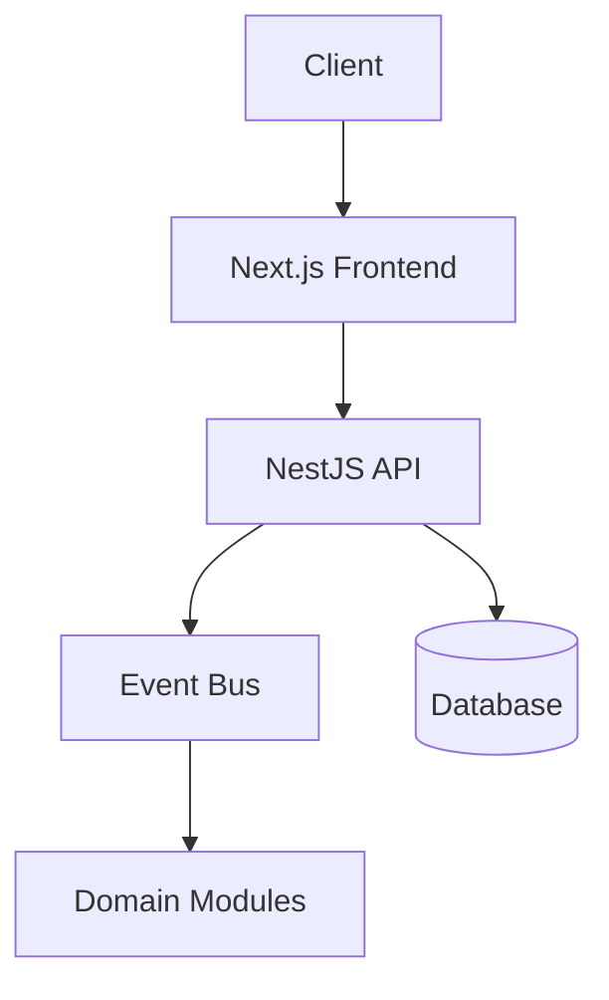
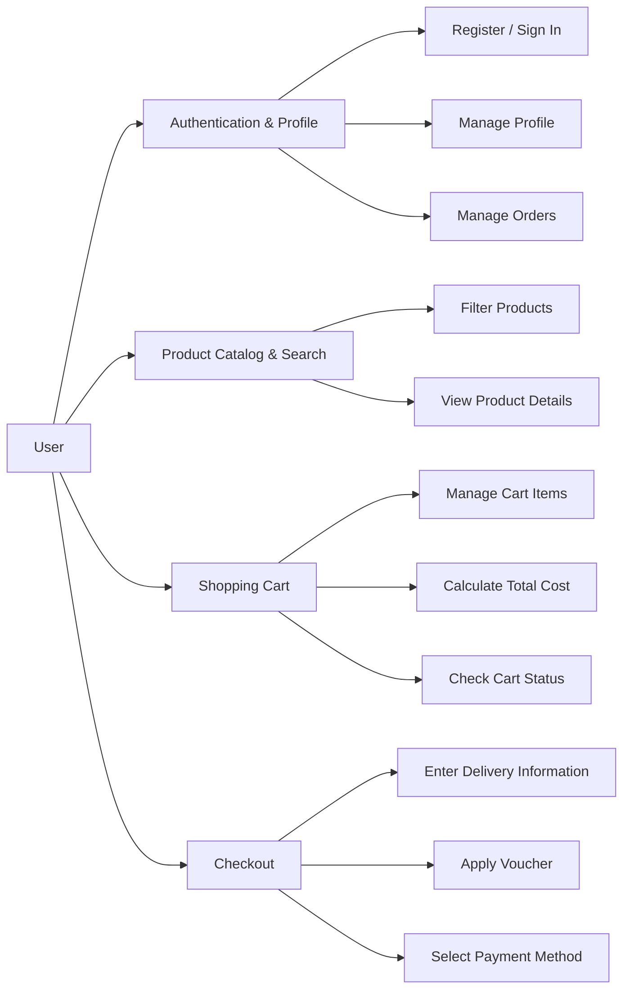
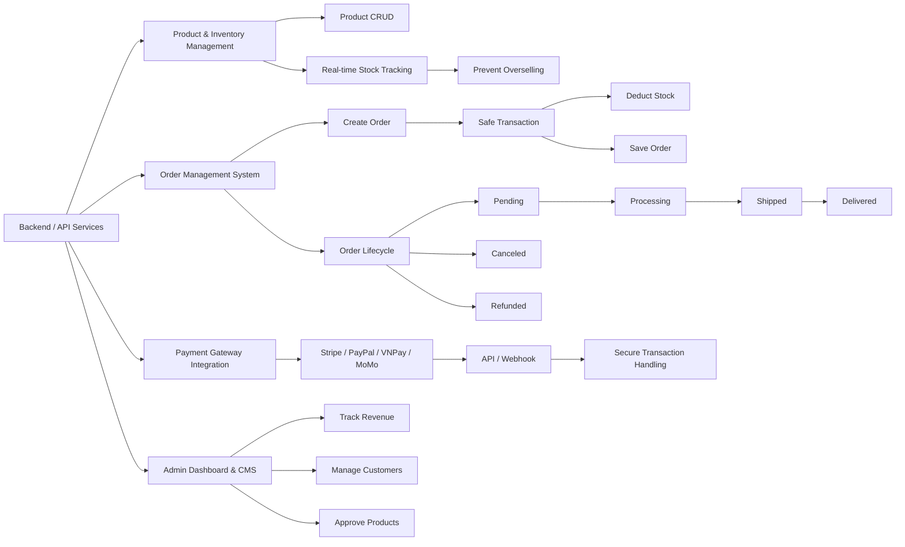

# Fullstack E-commerce platform with Typescript

Develop an e-commerce application using Next.js and NestJS in an Nx monorepo.  
Use Playwright for end-to-end testing and quality assurance.  
All packages listed below must use version 22.7.5.

## Problem Statement

The rapid shift towards e-commerce demands online platforms that do more than simply connect suppliers with consumers; they must also address complex challenges regarding scalability and performance. However, building a comprehensive e-commerce system often presents significant hurdles in optimizing business logic and ensuring a fluid interface.

To address this, the project focuses on developing a modern online shopping platform. The system is architected to fully satisfy the core workflows of an e-commerce platform while placing a strong emphasis on architectural optimization, delivering a seamless and stable user experience.

## Project Motivation

I chose this project to practice and improve my skills in each area of the software development lifecycle:

| Part | Skills |
| :--- | :--- |
| Frontend | Responsive design, component architecture, API integration |
| Backend | REST APIs, authentication, business logic |
| Database | Schema design, query optimization |
| Testing | End-to-end testing with Playwright |
| DevOps | CI/CD, deployment, Docker |
| Monorepo | Nx workspace management |

## System Architecture

The system uses a hybrid architecture, combining a Client-Server Architecture for simple CRUD features and an Event-Driven Architecture for communication between modules within the application.

## Core Features

### User Features

### Business Domain

## Project Milestone

<table>
  <thead>
    <tr>
      <th>Phase</th>
      <th>Duration</th>
      <th>Deliverable</th>
    </tr>
  </thead>
  <tbody>
    <tr>
      <td>Initial</td>
      <td>03/06/2026</td>
      <td>
        <ul>
          <li>Project Proposal</li>
        </ul>
      </td>
    </tr>
    <tr>
      <td>Analysis</td>
      <td>04/06/2026 - 05/06/2026</td>
      <td>
        <ul>
          <li>Software Requirement Specification</li>
          <li>Use Case Specification</li>
        </ul>
      </td>
    </tr>
    <tr>
      <td>Design</td>
      <td>06/06/2026 - 08/06/2026</td>
      <td>
        <ul>
          <li>Software Design Document</li>
          <li>Entity Relationship Diagram</li>
          <li>Api Documentation</li>
        </ul>
      </td>
    </tr>
    <tr>
      <td>Implementation</td>
      <td>09/06/2026 - 23/06/2026</td>
      <td>
        <ul>
          <li>Source code for all features with Unit Test</li>
        </ul>
      </td>
    </tr>
    <tr>
      <td>Testing</td>
      <td>24/06/2026 - 27/06/2026</td>
      <td>
        <ul>
          <li>Bug Report</li>
          <li>Release Candidate</li>
        </ul>
      </td>
    </tr>
    <tr>
      <td>Deployment</td>
      <td>28/06/2026</td>
      <td>
        <ul>
          <li>Live Server</li>
          <li>User Manual</li>
          <li>Project Report</li>
        </ul>
      </td>
    </tr>
  </tbody>
</table>