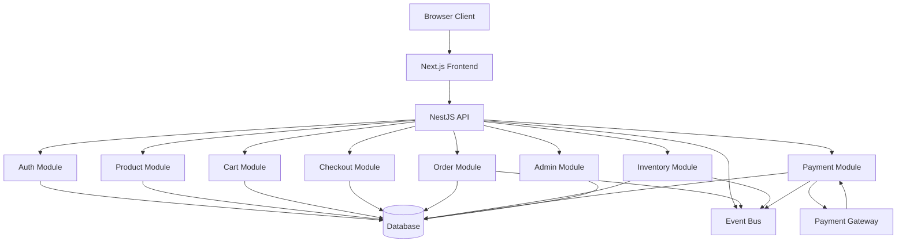
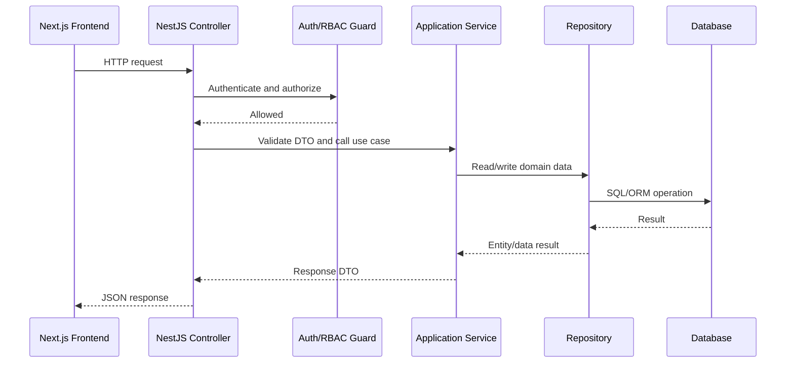
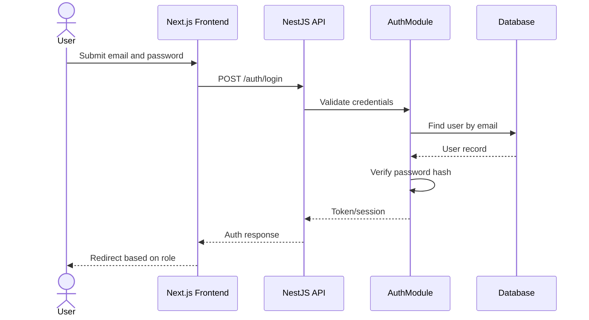
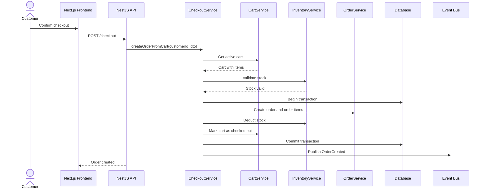
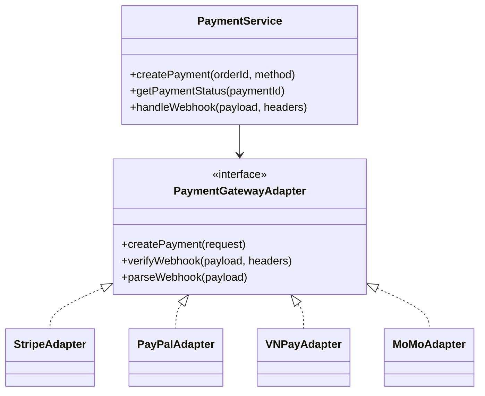
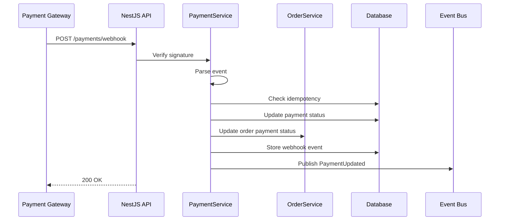
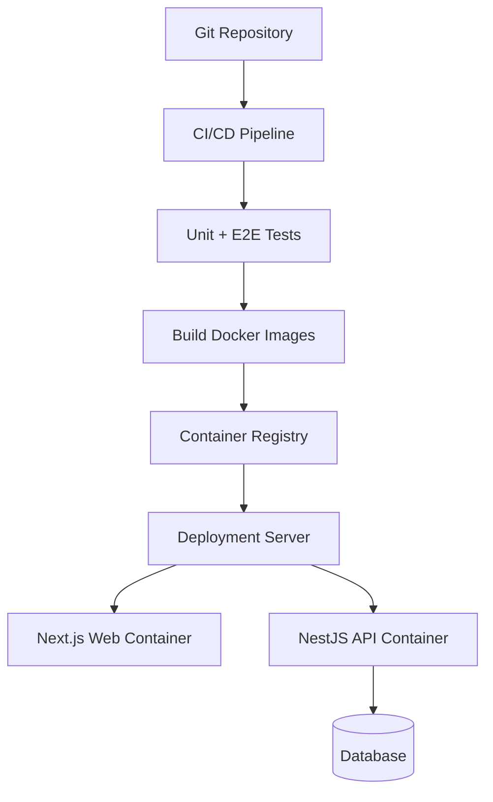

# Software Design Document

## Fullstack E-commerce Platform with TypeScript

**Version:** 1.0  
**Project Code:** ECOM-TS  
**Document Code:** ECOM-TS_SDD_1.0.md  
**Date:** 08/06/2026  
**Main Technologies:** Nx Monorepo, Next.js, NestJS, TypeScript, Playwright  
**Version Constraint:** All packages listed within the project scope must use version `22.7.5`.

---

## Revision History

| Date | Version | A/M/D | Description | Author |
| :--- | :--- | :---: | :--- | :--- |
| 08/06/2026 | 1.0 | A | Initial Software Design Document based on SRS and Use-Case Specification | Nguyen Hung Nguyen |

> A: Added; M: Modified; D: Deleted

---

## Table of Contents

1. [Introduction](#1-introduction)  
2. [Design Overview](#2-design-overview)  
3. [System Architecture](#3-system-architecture)  
4. [Nx Monorepo Structure](#4-nx-monorepo-structure)  
5. [Frontend Design](#5-frontend-design)  
6. [Backend Design](#6-backend-design)  
7. [Domain Module Design](#7-domain-module-design)  
8. [Database Design Overview](#8-database-design-overview)  
9. [API Design Overview](#9-api-design-overview)  
10. [Authentication and Authorization Design](#10-authentication-and-authorization-design)  
11. [Checkout and Order Transaction Design](#11-checkout-and-order-transaction-design)  
12. [Payment Integration Design](#12-payment-integration-design)  
13. [Event-driven Design](#13-event-driven-design)  
14. [Error Handling and Logging](#14-error-handling-and-logging)  
15. [Security Design](#15-security-design)  
16. [Testing Design](#16-testing-design)  
17. [Deployment Design](#17-deployment-design)  
18. [Design Decisions](#18-design-decisions)  
19. [Appendix](#19-appendix)

---

# 1. Introduction

## 1.1 Purpose

This Software Design Document describes the technical design of the Fullstack E-commerce Platform with TypeScript. It transforms the Software Requirements Specification and Use-Case Specification into an implementation-oriented design for frontend, backend, database, APIs, domain modules, deployment, and testing.

## 1.2 Scope

The system is a fullstack e-commerce application implemented in an Nx monorepo. It includes:

- Public product storefront.
- Customer authentication and profile management.
- Product catalog, search, filter, and product detail pages.
- Shopping cart and checkout.
- Order creation and order lifecycle management.
- Product and inventory management.
- Payment gateway integration.
- Admin dashboard and CMS.
- End-to-end testing using Playwright.
- Docker and CI/CD-ready deployment structure.

## 1.3 Intended Audience

| Audience | Purpose |
| :--- | :--- |
| Developer | Understand implementation structure, module responsibility, and integration points. |
| Tester | Understand testable components, flows, and quality strategy. |
| Instructor / Reviewer | Evaluate design completeness and consistency with requirements. |
| Maintainer | Understand how the system is organized for future enhancement. |

## 1.4 References

- Project Proposal: Fullstack E-commerce Platform with TypeScript.
- Software Requirements Specification: `srs_en.md`.
- Use-Case Specification: `use_case_specification.md`.
- Entity Relationship Diagram: `entity_relationship_diagram.md`.
- API Documentation: `api_documentation.md`.

---

# 2. Design Overview

## 2.1 Design Goals

The system design aims to satisfy the following goals:

1. **Scalability:** Separate business domains into clear modules and use event-driven communication for critical workflows.
2. **Maintainability:** Use Nx monorepo structure and shared libraries for DTOs, types, validation schemas, and utility functions.
3. **Reliability:** Ensure order creation and stock deduction are transactional and concurrency-safe.
4. **Security:** Protect authentication, authorization, payment handling, and sensitive information.
5. **Testability:** Support unit tests, integration tests, and Playwright end-to-end tests.
6. **User Experience:** Provide responsive storefront and admin interfaces.
7. **Deployability:** Support Dockerized services and CI/CD pipelines.

## 2.2 Architectural Style

The platform uses a hybrid architectural style:

| Style | Usage |
| :--- | :--- |
| Client-Server Architecture | Frontend communicates with backend through REST APIs for user-facing and admin workflows. |
| Modular Monolith | NestJS backend is organized into domain modules while remaining deployable as one API service for project simplicity. |
| Event-driven Architecture | Domain events coordinate side effects such as order creation, inventory deduction, payment updates, and status changes. |
| Layered Architecture | Backend modules are separated into controller, service/use-case, repository, domain, and infrastructure layers. |

---

# 3. System Architecture

## 3.1 High-level Architecture



## 3.2 Runtime Components

| Component | Responsibility |
| :--- | :--- |
| Browser Client | Runs the web UI and sends requests to the frontend/backend. |
| Next.js Frontend | Provides storefront, customer pages, checkout UI, and admin dashboard UI. |
| NestJS API | Provides REST APIs, authentication, business logic, and integration logic. |
| Database | Stores persistent business data. |
| Event Bus | Publishes and consumes internal domain events. |
| Payment Gateway | Processes payments and sends webhook events. |
| Playwright Test Runner | Executes end-to-end test scenarios. |

## 3.3 Component Interaction Summary

1. The user interacts with the Next.js frontend.
2. The frontend calls NestJS APIs using JSON over HTTP/HTTPS.
3. Backend controllers validate requests and delegate to domain services.
4. Domain services execute business rules and use repositories to access the database.
5. Important business events are published to the event bus.
6. Payment gateway callbacks are verified and processed by the payment module.
7. Admin users manage product, inventory, order, customer, and dashboard data through protected endpoints.

---

# 4. Nx Monorepo Structure

## 4.1 Proposed Workspace Structure

```text
ecom-ts/
├── apps/
│   ├── web/                     # Next.js storefront and admin UI
│   ├── api/                     # NestJS backend API
│   ├── api-e2e/                 # Test folder for api
│   └── web-e2e/                 # Test folder for web
├── libs/
│   ├── shared/types/            # Shared TypeScript interfaces and enums
│   ├── shared/dto/              # Shared request/response DTO definitions
│   ├── shared/validation/       # Validation schemas and constants
│   ├── shared/ui/               # Reusable frontend UI components
│   ├── shared/utils/            # Utility functions
│   ├── domain/auth/             # Auth domain logic
│   ├── domain/products/         # Product domain logic
│   ├── domain/cart/             # Cart domain logic
│   ├── domain/orders/           # Order domain logic
│   ├── domain/inventory/        # Inventory domain logic
│   ├── domain/payments/         # Payment domain logic
│   └── infrastructure/database/ # ORM, migrations, database clients
├── tools/                       # Custom Nx scripts and generators
├── docker/                      # Docker-related files
├── nx.json
├── package.json
└── tsconfig.base.json
```

## 4.2 Workspace Dependency Rules

| Rule | Description |
| :--- | :--- |
| Application-to-library dependency | Apps may import from shared and domain libraries. |
| No circular dependency | Libraries must not form circular imports. |
| Shared DTO consistency | Frontend and backend should share DTO and enum definitions where useful. |
| Domain isolation | Domain libraries should avoid depending on UI libraries. |
| Infrastructure boundary | Domain services should depend on repository interfaces where possible, not direct database implementation details. |

## 4.3 Package Version Constraint

All packages listed for the project must use version `22.7.5`. This is especially important for Nx-related packages to avoid version mismatch inside the monorepo.

---

# 5. Frontend Design

## 5.1 Frontend Technology

| Item | Design |
| :--- | :--- |
| Framework | Next.js |
| Language | TypeScript |
| UI Scope | Storefront, customer account, checkout, admin dashboard |
| Testing | Playwright E2E, component-level tests where applicable |
| API Communication | REST API client using typed DTOs |

## 5.2 Frontend Page Structure

```text
apps/web/src/
├── app/
│   ├── page.tsx                         # Home page
│   ├── products/page.tsx                 # Product listing
│   ├── products/[id]/page.tsx            # Product detail
│   ├── cart/page.tsx                     # Cart page
│   ├── checkout/page.tsx                 # Checkout page
│   ├── orders/page.tsx                   # Customer order history
│   ├── orders/[id]/page.tsx              # Customer order detail
│   ├── profile/page.tsx                  # Profile page
│   ├── auth/login/page.tsx               # Login page
│   ├── auth/register/page.tsx            # Registration page
│   └── admin/
│       ├── page.tsx                      # Dashboard
│       ├── products/page.tsx             # Product management
│       ├── inventory/page.tsx            # Inventory management
│       ├── orders/page.tsx               # Order management
│       ├── customers/page.tsx            # Customer management
│       └── approvals/page.tsx            # Product approvals
├── components/
├── features/
├── hooks/
├── lib/
└── styles/
```

## 5.3 Frontend Feature Modules

| Feature | Responsibility |
| :--- | :--- |
| Auth UI | Registration, sign-in, sign-out, route protection. |
| Product UI | Product list, filters, search, product detail. |
| Cart UI | Cart item management and total calculation display. |
| Checkout UI | Delivery form, voucher, payment method, order summary. |
| Order UI | Customer order history and order details. |
| Admin UI | Admin dashboard and management pages. |
| Shared UI | Buttons, forms, dialogs, tables, layout components. |

## 5.4 Frontend State Management

| State Type | Suggested Location |
| :--- | :--- |
| Authentication state | Auth provider or secure session strategy. |
| Cart state | Server-backed cart with client cache. |
| Product filters | URL query parameters for shareable/filterable pages. |
| Form state | Local component state or form library. |
| Server state | API client cache or framework-supported data fetching. |

## 5.5 Frontend Route Protection

| Route Group | Access Rule |
| :--- | :--- |
| Public routes | Accessible by guest, customer, and admin. |
| Customer routes | Require authenticated customer or admin depending on route policy. |
| Checkout routes | Require authenticated customer. |
| Admin routes | Require authenticated admin role. |

---

# 6. Backend Design

## 6.1 Backend Technology

| Item | Design |
| :--- | :--- |
| Framework | NestJS |
| Language | TypeScript |
| API Style | RESTful JSON APIs |
| Architecture | Modular, layered, event-aware backend |
| Persistence | Relational database or compatible transactional database |
| Authentication | Token/session-based authentication with role claims |

## 6.2 Backend Layering

Each major backend module follows this internal structure:

```text
module/
├── controllers/       # HTTP request/response handling
├── dto/               # Request and response DTOs
├── services/          # Application services and use-case orchestration
├── domain/            # Domain entities, policies, and business rules
├── repositories/      # Data access interface and implementations
├── events/            # Domain events and handlers
└── module.ts          # NestJS module declaration
```

## 6.3 Backend Modules

| Module | Responsibility |
| :--- | :--- |
| AuthModule | Registration, login, logout, current user, token/session management. |
| UsersModule | Profile, customer data, admin customer management. |
| ProductsModule | Product catalog, product CRUD, product visibility. |
| CategoriesModule | Product category management. |
| InventoryModule | Stock tracking, adjustment, stock validation, overselling prevention. |
| CartModule | Customer cart and cart item operations. |
| VouchersModule | Voucher validation and discount calculation. |
| CheckoutModule | Checkout validation and order creation orchestration. |
| OrdersModule | Order creation, order history, order detail, order lifecycle. |
| PaymentsModule | Payment request creation, payment status, webhook processing. |
| AdminModule | Aggregates admin dashboard and management features. |
| EventsModule | Event bus configuration and domain event handlers. |

## 6.4 Backend Request Flow



---

# 7. Domain Module Design

## 7.1 Auth Domain

### Responsibilities

- Register customer accounts.
- Authenticate users.
- Issue and validate sessions or tokens.
- Enforce role-based access.

### Main Entities

- User
- Role
- Session or Refresh Token, depending on implementation

### Main Services

| Service | Responsibility |
| :--- | :--- |
| AuthService | Registration, login, logout, current user. |
| PasswordService | Password hashing and verification. |
| TokenService | Token generation, validation, and expiry. |
| RbacGuard | Role-based route authorization. |

## 7.2 Product Domain

### Responsibilities

- Manage product catalog.
- Support product search, filter, and detail retrieval.
- Provide product data to cart and checkout.

### Main Entities

- Product
- Category
- ProductImage

### Main Services

| Service | Responsibility |
| :--- | :--- |
| ProductQueryService | Public product listing and details. |
| ProductCommandService | Admin product CRUD operations. |
| CategoryService | Category management. |

## 7.3 Inventory Domain

### Responsibilities

- Track stock quantity.
- Validate stock during cart and checkout.
- Deduct stock safely during order creation.
- Prevent overselling.

### Main Entities

- InventoryItem
- InventoryMovement

### Main Services

| Service | Responsibility |
| :--- | :--- |
| InventoryService | Stock read, adjustment, reservation, and deduction. |
| StockPolicy | Checks whether requested stock operation is valid. |

## 7.4 Cart Domain

### Responsibilities

- Manage customer cart.
- Add, update, and remove cart items.
- Calculate subtotal and total.
- Validate item quantity against stock.

### Main Entities

- Cart
- CartItem

### Main Services

| Service | Responsibility |
| :--- | :--- |
| CartService | Cart item commands and cart query. |
| CartPricingService | Cart subtotal and total calculation. |

## 7.5 Checkout and Order Domain

### Responsibilities

- Validate checkout data.
- Create orders atomically.
- Deduct inventory.
- Maintain order lifecycle.

### Main Entities

- Order
- OrderItem
- OrderStatusHistory
- AddressSnapshot

### Main Services

| Service | Responsibility |
| :--- | :--- |
| CheckoutService | Orchestrates checkout validation and order creation. |
| OrderService | Creates and manages orders. |
| OrderStatusPolicy | Validates order status transitions. |

## 7.6 Payment Domain

### Responsibilities

- Create payment requests.
- Integrate external payment gateways.
- Verify and process webhooks.
- Update payment and order payment status.

### Main Entities

- Payment
- PaymentTransaction
- PaymentWebhookEvent

### Main Services

| Service | Responsibility |
| :--- | :--- |
| PaymentService | Payment request and status management. |
| PaymentGatewayAdapter | Gateway-specific integration. |
| WebhookService | Signature verification and webhook idempotency. |

---

# 8. Database Design Overview

The detailed data model is defined in `entity_relationship_diagram.md`. The main database groups are:

| Group | Tables |
| :--- | :--- |
| Identity | users, roles, user_roles, sessions |
| Catalog | products, categories, product_images |
| Inventory | inventory_items, inventory_movements |
| Cart | carts, cart_items |
| Checkout | vouchers, voucher_redemptions, addresses |
| Orders | orders, order_items, order_status_histories |
| Payments | payments, payment_transactions, payment_webhook_events |
| Admin / Audit | audit_logs |

## 8.1 Database Principles

1. Use primary keys for all tables.
2. Use foreign keys to preserve relational integrity.
3. Use indexes on fields used frequently in search, filtering, and foreign key joins.
4. Use transaction boundaries for checkout and stock deduction.
5. Preserve historical order data using snapshots for product name, price, and address.
6. Keep payment webhook processing idempotent through unique external event IDs.

---

# 9. API Design Overview

The detailed endpoint contract is defined in `api_documentation.md`.

## 9.1 API Design Style

- RESTful JSON APIs.
- Resource-oriented endpoint naming.
- Standard HTTP status codes.
- Consistent error response format.
- Authentication through secure token/session strategy.
- Admin endpoints protected by RBAC guards.

## 9.2 Common Response Structure

### Success Response

```json
{
  "data": {},
  "meta": {}
}
```

### Error Response

```json
{
  "error": {
    "code": "VALIDATION_ERROR",
    "message": "Invalid request data.",
    "details": []
  }
}
```

---

# 10. Authentication and Authorization Design

## 10.1 Authentication Flow



## 10.2 Authorization Roles

| Role | Permissions |
| :--- | :--- |
| Guest | Browse products, view product details, register, sign in. |
| Customer | Manage profile, cart, checkout, payment, and own orders. |
| Admin | Manage products, inventory, orders, customers, approvals, and dashboard. |

## 10.3 Route Protection

| Endpoint Group | Required Access |
| :--- | :--- |
| `/products`, `/categories` | Public read access. |
| `/cart`, `/checkout`, `/orders` | Authenticated customer. |
| `/admin/**` | Authenticated admin. |
| `/payments/webhook` | Verified gateway webhook signature. |

---

# 11. Checkout and Order Transaction Design

## 11.1 Checkout Sequence



## 11.2 Transaction Rules

1. Cart validation, order creation, and stock deduction must happen inside a safe transaction.
2. If stock validation fails, the transaction must not create an order.
3. If order creation fails, stock must not be deducted.
4. If stock deduction fails, the order must not be committed.
5. Order item price must be snapshotted at checkout time.
6. Delivery address must be snapshotted at checkout time.

## 11.3 Overselling Prevention

The inventory design must prevent two customers from buying the same final stock unit at the same time. Acceptable strategies include:

- Row-level lock during checkout.
- Optimistic concurrency with version column.
- Atomic update query such as `UPDATE inventory SET stock = stock - ? WHERE product_id = ? AND stock >= ?`.

---

# 12. Payment Integration Design

## 12.1 Payment Gateway Adapter Pattern



## 12.2 Payment Webhook Flow



## 12.3 Payment Security Rules

1. Webhook signature must be verified before processing.
2. Client-side payment result must not be trusted as final confirmation.
3. Payment webhook events must be idempotent.
4. Secrets must be loaded from environment variables or secret storage.
5. Full card information must never be stored by the platform.

---

# 13. Event-driven Design

## 13.1 Domain Events

| Event | Producer | Consumer | Purpose |
| :--- | :--- | :--- | :--- |
| UserRegistered | AuthModule | Notification/Audit handler | Record registration or trigger welcome flow. |
| ProductCreated | ProductsModule | Audit handler | Track product creation. |
| InventoryUpdated | InventoryModule | Product/Admin handler | Refresh stock status. |
| OrderCreated | Checkout/OrdersModule | Payment, Audit, Notification handlers | Trigger payment or order notifications. |
| OrderStatusUpdated | OrdersModule | Notification, Dashboard handlers | Notify customer and update metrics. |
| PaymentCreated | PaymentsModule | Audit handler | Track payment initialization. |
| PaymentSucceeded | PaymentsModule | OrdersModule, Notification handler | Mark order as paid. |
| PaymentFailed | PaymentsModule | OrdersModule | Mark payment failure. |
| PaymentRefunded | PaymentsModule | OrdersModule | Mark order as refunded. |

## 13.2 Event Payload Example

```json
{
  "eventId": "evt_123",
  "type": "OrderCreated",
  "occurredAt": "2026-06-08T10:00:00.000Z",
  "data": {
    "orderId": "ord_123",
    "customerId": "usr_123",
    "totalAmount": 1500000
  }
}
```

## 13.3 Event Processing Rules

1. Event handlers should be idempotent where repeated events are possible.
2. Critical state transitions must still be protected by database constraints and service-level validation.
3. Event payloads should contain identifiers and immutable facts, not large mutable objects.
4. Failed event handlers should be logged and retried where appropriate.

---

# 14. Error Handling and Logging

## 14.1 Error Categories

| Category | Example |
| :--- | :--- |
| Validation Error | Missing delivery address or invalid email format. |
| Authentication Error | Invalid token or expired session. |
| Authorization Error | Customer attempts to access admin route. |
| Not Found Error | Product or order does not exist. |
| Business Rule Error | Requested quantity exceeds stock. |
| Payment Error | Payment gateway rejects transaction. |
| System Error | Database connection failure. |

## 14.2 Logging Rules

1. Log request ID, user ID where available, endpoint, status, and error code.
2. Do not log plaintext passwords, tokens, or payment secrets.
3. Payment webhook failures should include gateway event ID where available.
4. Checkout transaction failures should include order/cart identifiers without sensitive data.

---

# 15. Security Design

## 15.1 Security Controls

| Area | Control |
| :--- | :--- |
| Password | Secure hashing, never plaintext. |
| Authentication | Secure token or session. |
| Authorization | RBAC for customer and admin routes. |
| Input | DTO validation and sanitization. |
| Payment | Signature verification and secret protection. |
| API | HTTPS in production. |
| Database | Parameterized queries or ORM-safe query builder. |
| Admin | Strict route and permission checking. |

## 15.2 Sensitive Data

Sensitive data includes:

- Passwords.
- Authentication tokens.
- Payment gateway secrets.
- Webhook signing secrets.
- Customer personal information.
- Admin credentials.

These values must be protected through hashing, encryption where appropriate, environment variables, and access control.

---

# 16. Testing Design

## 16.1 Test Levels

| Test Level | Scope |
| :--- | :--- |
| Unit Test | Services, policies, validators, utility functions. |
| Integration Test | Module-level behavior with database or mocked external services. |
| End-to-End Test | Full user workflows through UI and APIs using Playwright. |

## 16.2 Playwright E2E Coverage

| Test ID | Workflow |
| :--- | :--- |
| E2E-001 | Register with valid information. |
| E2E-002 | Reject duplicate registration email. |
| E2E-003 | Sign in as customer. |
| E2E-004 | Browse, search, and filter products. |
| E2E-005 | View product detail. |
| E2E-006 | Add, update, and remove cart item. |
| E2E-007 | Checkout with valid cart. |
| E2E-008 | Apply valid and invalid voucher. |
| E2E-009 | Complete mocked online payment. |
| E2E-010 | View customer order history. |
| E2E-011 | Sign in as admin. |
| E2E-012 | Admin creates and updates product. |
| E2E-013 | Admin updates stock. |
| E2E-014 | Admin updates order status. |
| E2E-015 | Payment webhook is processed idempotently. |

---

# 17. Deployment Design

## 17.1 Deployment Components



## 17.2 Docker Services

| Service | Description |
| :--- | :--- |
| web | Next.js frontend application. |
| api | NestJS backend API. |
| db | Database service. |
| e2e | Optional Playwright test runner service. |

## 17.3 Environment Variables

| Variable | Description |
| :--- | :--- |
| `DATABASE_URL` | Database connection string. |
| `JWT_SECRET` | Authentication token secret if JWT is used. |
| `PAYMENT_GATEWAY_SECRET` | Secret for payment gateway API. |
| `PAYMENT_WEBHOOK_SECRET` | Secret used to verify webhook signatures. |
| `NEXT_PUBLIC_API_BASE_URL` | Public frontend API base URL. |
| `NODE_ENV` | Runtime environment. |

---

# 18. Design Decisions

| Decision | Rationale |
| :--- | :--- |
| Use Nx monorepo | Simplifies fullstack TypeScript code sharing and project organization. |
| Use Next.js frontend | Supports modern React UI, routing, server rendering options, and SEO-friendly product pages. |
| Use NestJS backend | Provides modular server architecture, decorators, DI, guards, and scalable API structure. |
| Use REST APIs | Simple and suitable for standard CRUD and transaction workflows. |
| Use event-driven module communication | Decouples order, inventory, payment, notification, and audit workflows. |
| Use transactional checkout | Prevents inconsistent orders and stock values. |
| Use Playwright | Validates real user workflows end-to-end. |

---

# 19. Appendix

## 19.1 Key Status Enums

### Order Status

| Status | Meaning |
| :--- | :--- |
| Pending | Order is created but not processed. |
| Processing | Order is being prepared. |
| Shipped | Order has been shipped. |
| Delivered | Order has been delivered. |
| Canceled | Order has been canceled. |
| Refunded | Order has been refunded. |

### Payment Status

| Status | Meaning |
| :--- | :--- |
| Pending | Payment is waiting for completion. |
| Succeeded | Payment has been verified successfully. |
| Failed | Payment failed. |
| Canceled | Payment was canceled. |
| Refunded | Payment has been refunded. |

## 19.2 Future Enhancements

- Product reviews and ratings.
- Product recommendation system.
- Multi-vendor marketplace features.
- Shipping provider integration.
- Email and notification service.
- Advanced analytics and reporting.
