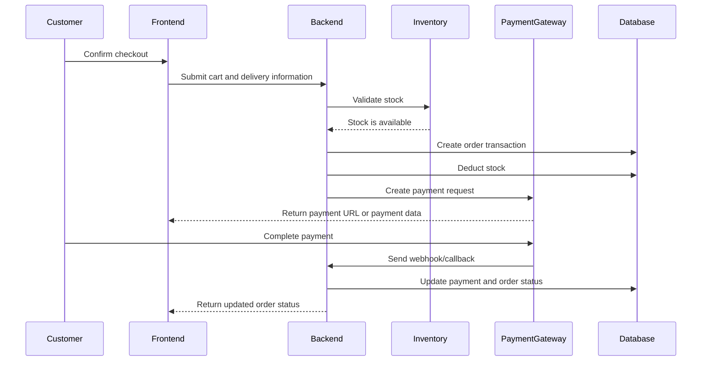

# SOFTWARE REQUIREMENTS SPECIFICATION

## FULLSTACK E-COMMERCE PLATFORM WITH TYPESCRIPT

**Version:** 1.0  
**Project Code:** ECOM-TS  
**Document Code:** ECOM-TS_SRS_1.0.md  
**Date:** 05/06/2026  
**Main Technologies:** Nx Monorepo, Next.js, NestJS, TypeScript, Playwright  
**Version Constraint:** All packages listed within the project scope must use version `22.7.5`.

---

## REVISION HISTORY

| Date       | Version | A/M/D | Description                                        | Author             |
| :--------- | :------ | :---: | :------------------------------------------------- | :----------------- |
| 05/06/2026 | 1.0     |   A   | Initial SRS document based on the Project Proposal | Nguyen Hung Nguyen |

> A: Added; M: Modified; D: Deleted

---

## TABLE OF CONTENTS

1. [Introduction](#1-introduction)  
   1.1. [Overview](#11-overview)  
   1.2. [Purpose](#12-purpose)  
   1.3. [Scope](#13-scope)  
   1.4. [Definitions, Acronyms, and Abbreviations](#14-definitions-acronyms-and-abbreviations)  
   1.5. [References](#15-references)
2. [Overall Description](#2-overall-description)  
   2.1. [Product Perspective](#21-product-perspective)  
   2.2. [Product Functions](#22-product-functions)  
   2.3. [User Characteristics](#23-user-characteristics)  
   2.4. [Constraints](#24-constraints)  
   2.5. [Assumptions and Dependencies](#25-assumptions-and-dependencies)  
   2.6. [Overall Use Case Model](#26-overall-use-case-model)
3. [Functional Requirements Specification](#3-functional-requirements-specification)
4. [Non-functional Requirements](#4-non-functional-requirements)
5. [Supporting Information](#5-supporting-information)

---

# 1. Introduction

## 1.1. Overview

This document specifies the software requirements for the **Fullstack E-commerce Platform with TypeScript** project. The system is a modern e-commerce platform that supports the core workflows of online shopping, including account registration, login, profile management, product search, shopping cart management, checkout, payment, order management, inventory management, payment gateway integration, and system administration.

The document is organized into the following main sections:

- **Introduction:** describes the purpose, scope, terminology, and reference documents.
- **Overall Description:** describes the product context, users, constraints, assumptions, and overall use case model.
- **Functional Requirements Specification:** describes the main functional requirement groups of the system.
- **Non-functional Requirements:** describes requirements related to reliability, security, user interface, performance, maintainability, environment, documentation, third-party components, legal concerns, and applicable standards.
- **Supporting Information:** provides appendices, diagrams, notes, and additional information to support the interpretation of the document.

## 1.2. Purpose

The purpose of this SRS document is to define and align the detailed business and technical requirements of the e-commerce platform. This document serves as the basis for the analysis, design, implementation, testing, acceptance, and deployment phases of the system.

Specifically, this document aims to:

- Clearly define the functional scope of the system.
- Clarify the roles and responsibilities of each user group.
- Specify functional and non-functional requirements.
- Provide a foundation for the Software Design Document, Entity Relationship Diagram, and API Documentation.
- Provide a basis for unit testing, Playwright end-to-end testing, and acceptance testing.
- Reduce the risk of requirement misunderstanding during the development process.

## 1.3. Scope

The system scope includes:

- A frontend application built with **Next.js**.
- A backend API built with **NestJS**.
- Workspace management using an **Nx monorepo**.
- **TypeScript** used across both frontend and backend.
- **Playwright** used for end-to-end testing.
- Customer-facing features: registration, login, profile management, product browsing, product search/filtering, cart management, checkout, payment, and order tracking.
- Administrative features: product management, inventory management, customer management, order management, product approval, and revenue tracking.
- Integration with third-party payment gateways such as Stripe, PayPal, VNPay, or MoMo.
- Docker-based deployment and CI/CD workflow support.

The current scope does not include:

- A separate native mobile application.
- AI-based product recommendation.
- Real-time chat between customers and sellers.
- A complete multi-vendor marketplace model unless extended in a later phase.

## 1.4. Definitions, Acronyms, and Abbreviations

| Term       | Meaning                                                                     |
| :--------- | :-------------------------------------------------------------------------- |
| SRS        | Software Requirements Specification                                         |
| Nx         | A monorepo management tool for build, test, and dependency graph management |
| Next.js    | A React framework used to build the frontend application                    |
| NestJS     | A Node.js framework used to build the backend API                           |
| TypeScript | A statically typed programming language built on top of JavaScript          |
| E2E        | End-to-End Testing, testing complete user workflows                         |
| API        | Application Programming Interface                                           |
| REST       | API design style based on resources and HTTP methods                        |
| DTO        | Data Transfer Object                                                        |
| RBAC       | Role-Based Access Control                                                   |
| OMS        | Order Management System                                                     |
| SKU        | Stock Keeping Unit                                                          |
| CRUD       | Create, Read, Update, Delete                                                |
| Webhook    | HTTP callback mechanism from an external system                             |
| CI/CD      | Continuous Integration / Continuous Delivery                                |
| CMS        | Content Management System                                                   |

## 1.5. References

| No. | Document                                                         |
| :-: | :--------------------------------------------------------------- |
|  1  | Official Nx documentation                                        |
|  2  | Official Next.js documentation                                   |
|  3  | Official NestJS documentation                                    |
|  4  | Official Playwright documentation                                |
|  5  | Payment gateway documentation for Stripe, PayPal, VNPay, or MoMo |
|  6  | Docker and CI/CD related documentation                           |

---

# 2. Overall Description

## 2.1. Product Functions

| Function Group                   | Description                                                                                |
| :------------------------------- | :----------------------------------------------------------------------------------------- |
| Authentication and Account       | Registration, login, logout, session management, and authorization                         |
| User Profile                     | View and update personal information                                                       |
| Product Catalog                  | View product lists, search, filter, and view product details                               |
| Shopping Cart                    | Add, update, remove cart items, and calculate total cost                                   |
| Checkout                         | Enter delivery information, apply voucher, and select payment method                       |
| Order Management                 | Create order, handle safe transaction, deduct stock, save order, and track order lifecycle |
| Product and Inventory Management | Product CRUD, stock update, and overselling prevention                                     |
| Payment Integration              | Integrate payment gateway and handle webhook/callback events                               |
| Admin Dashboard and CMS          | Manage revenue, customers, products, orders, and approvals                                 |
| Testing                          | Unit testing and Playwright end-to-end testing                                             |
| DevOps                           | Docker, CI/CD, and live server deployment                                                  |

## 2.2. User Characteristics

| User Group | Description                   | Main Needs                                                            |
| :--------- | :---------------------------- | :-------------------------------------------------------------------- |
| Guest      | Visitor who has not signed in | Browse products, search, filter, register, or sign in                 |
| Customer   | Authenticated user            | Manage profile, cart, checkout, payment, and orders                   |
| Admin      | System administrator          | Manage products, inventory, customers, orders, revenue, and approvals |

## 2.3. Constraints

| ID      | Constraint                                                                                                             |
| :------ | :--------------------------------------------------------------------------------------------------------------------- |
| CON-001 | The system must use an Nx monorepo.                                                                                    |
| CON-002 | The frontend must be built with Next.js.                                                                               |
| CON-003 | The backend must be built with NestJS.                                                                                 |
| CON-004 | The main programming language for the whole system must be TypeScript.                                                 |
| CON-005 | Playwright must be used for end-to-end testing and quality assurance.                                                  |
| CON-006 | All packages listed in the project scope must use version `22.7.5`.                                                    |
| CON-007 | The system must enforce role-based access control for protected resources.                                             |
| CON-008 | Sensitive information such as passwords, tokens, payment secrets, and API keys must not be exposed on the client side. |
| CON-009 | Order creation and stock deduction must be handled safely to prevent overselling.                                      |
| CON-010 | The system must support Docker-based deployment.                                                                       |

## 2.4. Assumptions and Dependencies

| ID     | Assumption / Dependency                                                            |
| :----- | :--------------------------------------------------------------------------------- |
| AD-001 | Users have internet access and use a supported browser.                            |
| AD-002 | External payment gateways are available and provide valid API credentials.         |
| AD-003 | The database service is available during backend operation.                        |
| AD-004 | Admin accounts are created or assigned through a controlled process.               |
| AD-005 | CI/CD and deployment infrastructure are available during the deployment phase.     |
| AD-006 | Email, SMS, or notification services are optional unless added in a later version. |

---

# 3. Functional Requirements Specification

## 3.1. Authentication and Account Management

### 3.1.1. Description

The system shall allow users to register, sign in, sign out, and maintain secure authentication sessions. It shall also support role-based access control for customer and admin permissions.

### 3.1.2. Functional Requirements

| ID          | Requirement                                                                      | Priority |
| :---------- | :------------------------------------------------------------------------------- | :------- |
| FR-AUTH-001 | The system shall allow a guest to register using required account information.   | High     |
| FR-AUTH-002 | The system shall validate registration input before creating an account.         | High     |
| FR-AUTH-003 | The system shall prevent duplicate accounts using the same email.                | High     |
| FR-AUTH-004 | The system shall store passwords using a secure hashing mechanism.               | High     |
| FR-AUTH-005 | The system shall allow registered users to sign in using valid credentials.      | High     |
| FR-AUTH-006 | The system shall reject invalid credentials with a clear error message.          | High     |
| FR-AUTH-007 | The system shall allow authenticated users to sign out.                          | Medium   |
| FR-AUTH-008 | The system shall maintain secure authentication sessions or tokens.              | High     |
| FR-AUTH-009 | The system shall support role-based access control for customer and admin roles. | High     |

### 3.1.3. Acceptance Criteria

- A user can register with valid information.
- A duplicate email cannot be registered twice.
- A registered user can sign in and access customer-only pages.
- An unauthenticated user cannot access protected checkout or profile pages.
- A customer cannot access admin-only features.

## 3.2. Profile Management

### 3.2.1. Description

The system shall allow authenticated users to view and update their personal profile information.

### 3.2.2. Functional Requirements

| ID             | Requirement                                                                             | Priority |
| :------------- | :-------------------------------------------------------------------------------------- | :------- |
| FR-PROFILE-001 | The system shall allow a customer to view their profile.                                | High     |
| FR-PROFILE-002 | The system shall allow a customer to update profile information.                        | Medium   |
| FR-PROFILE-003 | The system shall validate profile data before saving.                                   | High     |
| FR-PROFILE-004 | The system shall prevent a customer from viewing or editing another customer's profile. | High     |

### 3.2.3. Acceptance Criteria

- A customer can view their own account information.
- Invalid profile data is rejected.
- Profile updates are saved and reflected correctly.

## 3.3. Product Catalog and Search

### 3.3.1. Description

The system shall provide a product catalog that allows users to browse, search, filter, and view product details.

### 3.3.2. Functional Requirements

| ID             | Requirement                                                                                                       | Priority |
| :------------- | :---------------------------------------------------------------------------------------------------------------- | :------- |
| FR-PRODUCT-001 | The system shall display a list of available products.                                                            | High     |
| FR-PRODUCT-002 | The system shall allow users to search products by keyword.                                                       | High     |
| FR-PRODUCT-003 | The system shall allow users to filter products by category, price, availability, and other supported attributes. | High     |
| FR-PRODUCT-004 | The system shall allow users to view product details.                                                             | High     |
| FR-PRODUCT-005 | The system shall display product price, description, images, inventory status, and other relevant information.    | High     |
| FR-PRODUCT-006 | The system shall support pagination or lazy loading for product lists.                                            | Medium   |
| FR-PRODUCT-007 | The system shall hide or clearly mark unavailable products based on stock status.                                 | Medium   |

### 3.3.3. Acceptance Criteria

- Users can search and filter products.
- Product detail pages show accurate information.
- Out-of-stock products are clearly identified.
- Product lists remain usable on both desktop and mobile screens.

## 3.4. Shopping Cart

### 3.4.1. Description

The system shall allow customers to manage shopping cart items before checkout.

### 3.4.2. Functional Requirements

| ID          | Requirement                                                                                     | Priority |
| :---------- | :---------------------------------------------------------------------------------------------- | :------- |
| FR-CART-001 | The system shall allow customers to add products to the cart.                                   | High     |
| FR-CART-002 | The system shall allow customers to update item quantity in the cart.                           | High     |
| FR-CART-003 | The system shall allow customers to remove items from the cart.                                 | High     |
| FR-CART-004 | The system shall calculate subtotal, discount, shipping fee, tax if applicable, and total cost. | High     |
| FR-CART-005 | The system shall validate cart item quantity against available stock.                           | High     |
| FR-CART-006 | The system shall notify customers when cart items become unavailable.                           | Medium   |
| FR-CART-007 | The system shall persist cart data for authenticated customers.                                 | Medium   |

### 3.4.3. Acceptance Criteria

- A customer can add, update, and remove cart items.
- Cart total updates correctly when quantity changes.
- A customer cannot checkout with a quantity greater than available stock.

## 3.5. Checkout

### 3.5.1. Description

The system shall allow customers to complete checkout by providing delivery information, applying vouchers, selecting a payment method, and confirming an order.

### 3.5.2. Functional Requirements

| ID              | Requirement                                                                                                                       | Priority |
| :-------------- | :-------------------------------------------------------------------------------------------------------------------------------- | :------- |
| FR-CHECKOUT-001 | The system shall require authentication before checkout.                                                                          | High     |
| FR-CHECKOUT-002 | The system shall allow customers to enter delivery information.                                                                   | High     |
| FR-CHECKOUT-003 | The system shall validate required delivery information.                                                                          | High     |
| FR-CHECKOUT-004 | The system shall allow customers to apply a valid order-wide, product-specific, or category-specific voucher.                     | Medium   |
| FR-CHECKOUT-005 | The system shall reject invalid, expired, or inapplicable vouchers, including vouchers that do not match cart products/categories. | Medium   |
| FR-CHECKOUT-006 | The system shall allow customers to select a supported payment method.                                                            | High     |
| FR-CHECKOUT-007 | The system shall show a final order summary before confirmation.                                                                  | High     |
| FR-CHECKOUT-008 | The system shall create an order only after successful validation of cart, stock, delivery information, and payment requirements. | High     |

### 3.5.3. Acceptance Criteria

- Checkout requires a signed-in customer.
- Required delivery fields are validated.
- Valid vouchers reduce the order total correctly according to their order, product, or category scope.
- Invalid vouchers are rejected with clear feedback.
- The order summary displays the correct final amount.

## 3.6. Order Management

### 3.6.1. Description

The system shall support safe order creation and order lifecycle management.

### 3.6.2. Functional Requirements

| ID           | Requirement                                                                                                             | Priority |
| :----------- | :---------------------------------------------------------------------------------------------------------------------- | :------- |
| FR-ORDER-001 | The system shall create an order from valid cart items.                                                                 | High     |
| FR-ORDER-002 | The system shall create orders inside a safe database transaction.                                                      | High     |
| FR-ORDER-003 | The system shall deduct stock during order creation.                                                                    | High     |
| FR-ORDER-004 | The system shall prevent overselling by validating and locking stock when required.                                     | High     |
| FR-ORDER-005 | The system shall save order items, delivery information, payment method, and total amount.                              | High     |
| FR-ORDER-006 | The system shall allow customers to view their order history.                                                           | High     |
| FR-ORDER-007 | The system shall allow customers to view order details.                                                                 | High     |
| FR-ORDER-008 | The system shall support order statuses: Pending, Processing, Shipped, Delivered, Canceled, and Refunded.               | High     |
| FR-ORDER-009 | The system shall allow admins to update order status according to valid lifecycle transitions.                          | High     |
| FR-ORDER-010 | The system shall restore or compensate stock when an order is canceled before fulfillment, according to business rules. | Medium   |

### 3.6.3. Order Status Flow

| Status     | Meaning                                         |
| :--------- | :---------------------------------------------- |
| Pending    | Order has been created but is not yet processed |
| Processing | Order is being prepared                         |
| Shipped    | Order has been shipped                          |
| Delivered  | Order has been delivered to the customer        |
| Canceled   | Order has been canceled                         |
| Refunded   | Payment has been refunded                       |

### 3.6.4. Acceptance Criteria

- Order creation is atomic.
- Stock is deducted exactly once for each successful order.
- Invalid stock conditions prevent order creation.
- Customers can only view their own orders.
- Admins can update order status using allowed transitions.

## 3.7. Product and Inventory Management

### 3.7.1. Description

The system shall allow admins to manage products and track inventory.

### 3.7.2. Functional Requirements

| ID         | Requirement                                                                   | Priority |
| :--------- | :---------------------------------------------------------------------------- | :------- |
| FR-INV-001 | The system shall allow admins to create products.                             | High     |
| FR-INV-002 | The system shall allow admins to update product information.                  | High     |
| FR-INV-003 | The system shall allow admins to delete or deactivate products.               | Medium   |
| FR-INV-004 | The system shall allow admins to manage product categories.                   | Medium   |
| FR-INV-005 | The system shall allow admins to update product stock quantity.               | High     |
| FR-INV-006 | The system shall track real-time stock availability.                          | High     |
| FR-INV-007 | The system shall prevent stock quantity from becoming negative.               | High     |
| FR-INV-008 | The system shall record inventory changes for audit purposes when applicable. | Medium   |

### 3.7.3. Acceptance Criteria

- Admins can create, update, and manage products.
- Stock quantity is visible and accurate.
- Stock cannot become negative after checkout or manual update.

## 3.8. Payment Gateway Integration

### 3.8.1. Description

The system shall integrate with at least one payment gateway such as Stripe, PayPal, VNPay, or MoMo.

### 3.8.2. Functional Requirements

| ID         | Requirement                                                                                     | Priority |
| :--------- | :---------------------------------------------------------------------------------------------- | :------- |
| FR-PAY-001 | The system shall allow customers to choose a supported payment method.                          | High     |
| FR-PAY-002 | The system shall create payment requests through the selected payment gateway.                  | High     |
| FR-PAY-003 | The system shall redirect customers or open the required payment flow according to the gateway. | High     |
| FR-PAY-004 | The system shall process payment webhook or callback events securely.                           | High     |
| FR-PAY-005 | The system shall verify payment signature or authenticity before updating order payment status. | High     |
| FR-PAY-006 | The system shall update order payment status after successful payment confirmation.             | High     |
| FR-PAY-007 | The system shall handle failed, canceled, expired, or refunded payments.                        | High     |
| FR-PAY-008 | The system shall not store sensitive card information on the platform.                          | High     |

### 3.8.3. Acceptance Criteria

- A payment request is created for a valid order.
- Payment result is reflected in order status.
- Invalid webhook signatures are rejected.
- Sensitive payment credentials are not exposed in frontend code.

## 3.9. Admin Dashboard and CMS

### 3.9.1. Description

The system shall provide an administrative dashboard for managing business operations.

### 3.9.2. Functional Requirements

| ID           | Requirement                                                                                   | Priority |
| :----------- | :-------------------------------------------------------------------------------------------- | :------- |
| FR-ADMIN-001 | The system shall allow admins to access an admin dashboard.                                   | High     |
| FR-ADMIN-002 | The system shall restrict dashboard access to admin users only.                               | High     |
| FR-ADMIN-003 | The system shall allow admins to manage products and inventory.                               | High     |
| FR-ADMIN-004 | The system shall allow admins to manage customer records.                                     | Medium   |
| FR-ADMIN-005 | The system shall allow admins to manage orders and order statuses.                            | High     |
| FR-ADMIN-006 | The system shall allow admins to approve or reject products when product approval is enabled. | Medium   |
| FR-ADMIN-007 | The system shall display revenue and sales statistics.                                        | Medium   |
| FR-ADMIN-008 | The system shall provide filters for admin lists such as products, customers, and orders.     | Medium   |

### 3.9.3. Acceptance Criteria

- Only admin users can access admin features.
- Admins can manage product and order data.
- Revenue statistics are calculated from valid order and payment data.

## 3.10. Backend API

### 3.10.1. Description

The backend shall expose REST APIs for the frontend application. APIs shall use JSON request and response bodies, follow consistent error response formats, and be protected according to authentication and authorization requirements.

### 3.10.2. Proposed Endpoints

| Method | Endpoint                       | Description                                       |
| :----- | :----------------------------- | :------------------------------------------------ |
| POST   | `/auth/register`               | Register a new account                            |
| POST   | `/auth/login`                  | Authenticate user                                 |
| POST   | `/auth/logout`                 | Sign out user                                     |
| GET    | `/auth/me`                     | Get current authenticated user                    |
| GET    | `/products`                    | List products with search, filter, and pagination |
| GET    | `/products/:id`                | Get product detail                                |
| POST   | `/admin/products`              | Create product                                    |
| PATCH  | `/admin/products/:id`          | Update product                                    |
| DELETE | `/admin/products/:id`          | Delete or deactivate product                      |
| GET    | `/cart`                        | Get current customer's cart                       |
| POST   | `/cart/items`                  | Add item to cart                                  |
| PATCH  | `/cart/items/:id`              | Update cart item quantity                         |
| DELETE | `/cart/items/:id`              | Remove cart item                                  |
| DELETE | `/cart`                        | Clear cart                                        |
| POST   | `/checkout`                    | Validate checkout and create order                |
| GET    | `/orders`                      | Get customer order history                        |
| GET    | `/orders/:id`                  | Get order detail                                  |
| PATCH  | `/admin/orders/:id/status`     | Update order status                               |
| POST   | `/payments/create`             | Create payment request                            |
| POST   | `/payments/webhook`            | Receive payment gateway webhook                   |
| GET    | `/payments/:id/status`         | Get payment status                                |
| GET    | `/admin/dashboard`             | Get dashboard statistics                          |
| GET    | `/admin/customers`             | List customers                                    |
| GET    | `/admin/orders`                | List orders                                       |
| GET    | `/admin/revenue`               | Get revenue metrics                               |
| PATCH  | `/admin/products/:id/approval` | Approve or reject product                         |

---

# 4. Non-functional Requirements

## 4.1. Reliability Requirements

| ID          | Requirement                                                                                 |
| :---------- | :------------------------------------------------------------------------------------------ |
| NFR-REL-001 | The system shall maintain data consistency during order creation and stock deduction.       |
| NFR-REL-002 | The system shall prevent duplicate orders caused by repeated checkout submissions.          |
| NFR-REL-003 | The system shall handle payment webhook retries without applying duplicate payment updates. |
| NFR-REL-004 | The system shall provide meaningful error messages when an operation fails.                 |
| NFR-REL-005 | The system shall log backend errors for debugging and maintenance.                          |

## 4.2. Security Requirements

| ID          | Requirement                                                                                           |
| :---------- | :---------------------------------------------------------------------------------------------------- |
| NFR-SEC-001 | Passwords shall be hashed before being stored.                                                        |
| NFR-SEC-002 | Protected APIs shall require authentication.                                                          |
| NFR-SEC-003 | Admin APIs shall require admin authorization.                                                         |
| NFR-SEC-004 | User input shall be validated to reduce injection and invalid data risks.                             |
| NFR-SEC-005 | Payment webhook requests shall be verified before processing.                                         |
| NFR-SEC-006 | Sensitive configuration values shall be stored in environment variables or secret management systems. |
| NFR-SEC-007 | The frontend shall not expose private API keys or payment secrets.                                    |
| NFR-SEC-008 | Production communication shall use HTTPS.                                                             |

## 4.3. User Interface Requirements

| ID         | Requirement                                                                     |
| :--------- | :------------------------------------------------------------------------------ |
| NFR-UI-001 | The interface shall be responsive for desktop, tablet, and mobile devices.      |
| NFR-UI-002 | Main user flows shall have clear navigation and visible feedback.               |
| NFR-UI-003 | Forms shall display validation messages near invalid fields.                    |
| NFR-UI-004 | Product cards shall display image, name, price, and availability status.        |
| NFR-UI-005 | The cart and checkout pages shall display itemized pricing and total cost.      |
| NFR-UI-006 | Loading, empty, success, and error states shall be displayed where applicable.  |
| NFR-UI-007 | The admin dashboard shall provide readable tables, filters, and action buttons. |

## 4.4. Performance Requirements

| ID           | Requirement                                                                                                                    |
| :----------- | :----------------------------------------------------------------------------------------------------------------------------- |
| NFR-PERF-001 | Product listing pages should load within an acceptable response time under normal traffic conditions.                          |
| NFR-PERF-002 | Product search and filter APIs shall support pagination to avoid excessive payload size.                                       |
| NFR-PERF-003 | Checkout and order creation shall complete without duplicate order creation under normal concurrent use.                       |
| NFR-PERF-004 | The system shall use database indexes for frequently queried fields such as product name, category, user ID, and order status. |
| NFR-PERF-005 | The frontend should optimize image loading and reduce unnecessary API calls.                                                   |

## 4.5. Supportability and Maintainability Requirements

| ID           | Requirement                                                                                                      |
| :----------- | :--------------------------------------------------------------------------------------------------------------- |
| NFR-MAIN-001 | The codebase shall be organized in an Nx monorepo.                                                               |
| NFR-MAIN-002 | Frontend and backend code shall follow consistent TypeScript coding standards.                                   |
| NFR-MAIN-003 | Backend modules shall be organized by domain, such as Auth, Product, Cart, Order, Payment, Inventory, and Admin. |
| NFR-MAIN-004 | Shared types, DTOs, and utilities should be placed in reusable libraries when appropriate.                       |
| NFR-MAIN-005 | The system shall include unit tests for critical business logic.                                                 |
| NFR-MAIN-006 | The system shall include Playwright E2E tests for core user workflows.                                           |
| NFR-MAIN-007 | Build, test, and lint commands shall be executable through Nx.                                                   |

## 4.6. Environmental Requirements

| ID          | Requirement                                                                                                    |
| :---------- | :------------------------------------------------------------------------------------------------------------- |
| NFR-ENV-001 | The backend shall run on a Node.js environment compatible with NestJS.                                         |
| NFR-ENV-002 | The frontend shall run as a Next.js application.                                                               |
| NFR-ENV-003 | The system shall support environment-specific configuration for development, testing, staging, and production. |
| NFR-ENV-004 | The system shall support Docker-based local and production deployment.                                         |
| NFR-ENV-005 | The CI/CD pipeline shall run installation, linting, testing, building, and deployment steps where applicable.  |

## 4.7. Online Documentation and Help System Requirements

| ID          | Requirement                                                                             |
| :---------- | :-------------------------------------------------------------------------------------- |
| NFR-DOC-001 | The project shall include setup instructions for developers.                            |
| NFR-DOC-002 | The project shall include API documentation for backend endpoints.                      |
| NFR-DOC-003 | The project shall include a user manual as part of the deployment deliverables.         |
| NFR-DOC-004 | The project shall include testing instructions for unit tests and Playwright E2E tests. |
| NFR-DOC-005 | The project shall include deployment instructions for Docker and CI/CD.                 |

## 4.8. Third-party Components

| Component       | Purpose                       |
| :-------------- | :---------------------------- |
| Next.js         | Frontend framework            |
| NestJS          | Backend API framework         |
| Nx              | Monorepo workspace management |
| Playwright      | End-to-end testing            |
| Payment Gateway | Online payment processing     |
| Docker          | Containerization              |
| Database Engine | Persistent data storage       |

## 4.9. Legal, Copyright, and Other Notes

| ID            | Requirement                                                                                 |
| :------------ | :------------------------------------------------------------------------------------------ |
| NFR-LEGAL-001 | The system shall not store raw card information or sensitive payment details.               |
| NFR-LEGAL-002 | The system shall protect user information according to applicable privacy expectations.     |
| NFR-LEGAL-003 | Third-party libraries shall be used according to their licenses.                            |
| NFR-LEGAL-004 | Payment gateway integration shall follow the provider's security and compliance guidelines. |

## 4.10. Applicable Standards

| Standard / Practice     | Application                           |
| :---------------------- | :------------------------------------ |
| RESTful API design      | Backend API structure                 |
| JSON                    | API request and response format       |
| RBAC                    | Authorization model                   |
| Secure password hashing | Account security                      |
| HTTPS                   | Secure production communication       |
| CI/CD practices         | Automated build, test, and deployment |
| E2E testing practice    | Playwright workflow validation        |

---

# 5. Supporting Information

## 5.1. Appendix A - Proposed Data Entities

| Entity    | Description                                                                     |
| :-------- | :------------------------------------------------------------------------------ |
| User      | Stores account, role, and authentication-related information                    |
| Profile   | Stores personal information of a user                                           |
| Product   | Stores product information such as name, description, price, image, and status  |
| Category  | Stores product categories                                                       |
| Inventory | Stores stock quantity and inventory-related information                         |
| Cart      | Stores a customer's active shopping cart                                        |
| CartItem  | Stores products and quantities inside a cart                                    |
| Order     | Stores order header information, total amount, status, and customer information |
| OrderItem | Stores products and quantities inside an order                                  |
| Payment   | Stores payment request, gateway reference, payment status, and amount           |
| Voucher   | Stores discount code, validity, scope, and discount rules                       |
| AdminLog  | Stores administrative actions for audit purposes where applicable               |

## 5.2. Appendix B - Proposed Checkout Flow



## 5.3. Appendix C - Proposed Playwright E2E Test List

| Test ID | Scenario                                           |
| :------ | :------------------------------------------------- |
| E2E-001 | User registration with valid data                  |
| E2E-002 | User login with valid credentials                  |
| E2E-003 | User login with invalid credentials                |
| E2E-004 | Product search and filter                          |
| E2E-005 | View product detail                                |
| E2E-006 | Add product to cart                                |
| E2E-007 | Update cart quantity                               |
| E2E-008 | Remove cart item                                   |
| E2E-009 | Checkout with valid delivery information           |
| E2E-010 | Apply valid voucher                                |
| E2E-011 | Reject invalid voucher                             |
| E2E-012 | Complete payment flow with mocked gateway response |
| E2E-013 | View order history                                 |
| E2E-014 | Admin creates or updates product                   |
| E2E-015 | Admin updates order status                         |
| E2E-016 | Unauthorized user cannot access admin page         |

## 5.4. Appendix D - Project Milestones

| Phase          | Duration                | Deliverable                                                              |
| :------------- | :---------------------- | :----------------------------------------------------------------------- |
| Initial        | 03/06/2026              | Project Proposal                                                         |
| Analysis       | 04/06/2026 - 05/06/2026 | Software Requirement Specification; Use Case Specification               |
| Design         | 06/06/2026 - 08/06/2026 | Software Design Document; Entity Relationship Diagram; API Documentation |
| Implementation | 09/06/2026 - 23/06/2026 | Source code for all features with Unit Test                              |
| Testing        | 24/06/2026 - 27/06/2026 | Bug Report; Release Candidate                                            |
| Deployment     | 28/06/2026              | Live Server; User Manual; Project Report                                 |

## 5.5. Appendix E - Technical Implementation Notes

### Nx Monorepo Structure

A proposed repository structure is:

```text
apps/
  web/              # Next.js frontend
  api/              # NestJS backend
  web-e2e/          # Frontend test
  api-e2e/          # Backend test
```

### Backend Domain Modules

Proposed NestJS modules:

- AuthModule
- UserModule
- ProductModule
- CategoryModule
- InventoryModule
- CartModule
- CheckoutModule
- OrderModule
- PaymentModule
- VoucherModule
- AdminModule

### Event-driven Communication

Proposed domain events:

| Event               | Description                                     |
| :------------------ | :---------------------------------------------- |
| `order.created`     | Triggered after an order is created             |
| `stock.deducted`    | Triggered after stock is deducted               |
| `payment.succeeded` | Triggered after successful payment confirmation |
| `payment.failed`    | Triggered after failed payment confirmation     |
| `order.canceled`    | Triggered after an order is canceled            |
| `order.refunded`    | Triggered after refund processing               |

## 5.6. Appendix F - Version 1.0 Scope Notes

The first version of the project should focus on completing the core e-commerce workflow:

1. User registration and login.
2. Product listing, search, filtering, and product detail.
3. Shopping cart management.
4. Checkout and order creation.
5. Safe stock deduction.
6. Payment gateway integration or mocked payment flow if real credentials are unavailable.
7. Customer order history.
8. Basic admin dashboard for product, inventory, and order management.
9. Playwright E2E tests for the main user workflows.
10. Docker-based deployment and project report.

Features such as AI recommendation, advanced promotion engine, full marketplace support, real-time chat, and mobile native apps may be planned for later versions.
