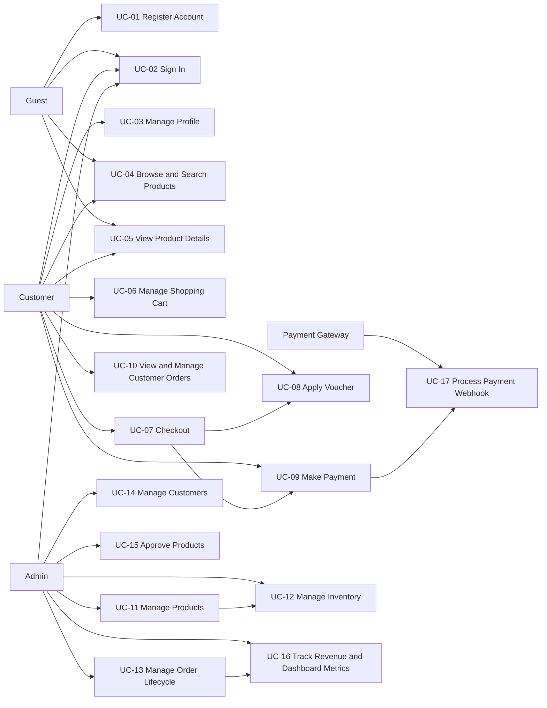
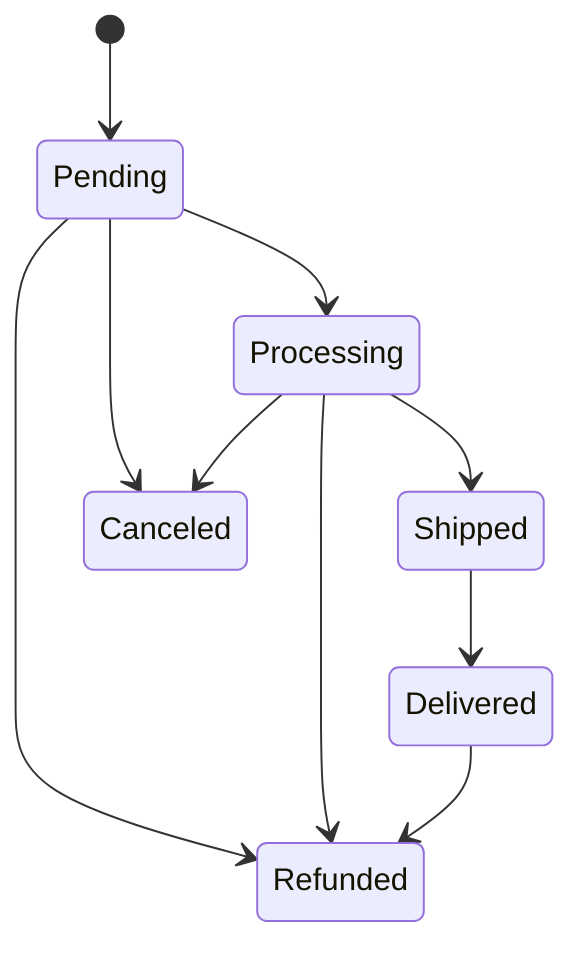
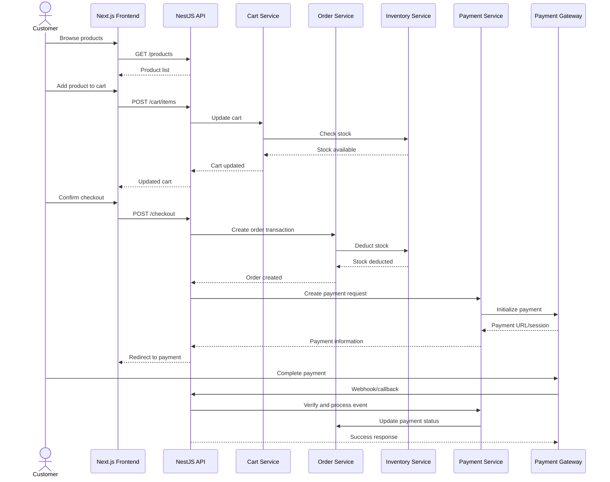

# Use-Case Specification

## Fullstack E-commerce Platform with TypeScript

**Version:** 1.0  
**Date:** 05/06/2026  
**Project:** Fullstack E-commerce Platform with TypeScript  
**Document Type:** Use-Case Specification  
**Template Source:** RUP Use-Case Specification Template (`rup_ucspec.dot`)  
**Architecture:** Nx Monorepo, Next.js Frontend, NestJS Backend, Event-driven Domain Modules  
**Testing:** Playwright End-to-End Testing  
**Technology Constraint:** All listed project packages must use version `22.7.5`.

---

## Revision History

| Date       | Version | Description                                                                        | Author             |
| :--------- | :------ | :--------------------------------------------------------------------------------- | :----------------- |
| 05/06/2026 | 1.0     | Initial Use-Case Specification based on project proposal and RUP use-case template | Nguyen Hung Nguyen |

---

## Table of Contents

1. [Introduction](#1-introduction)
2. [Actor List](#2-actor-list)
3. [Use-Case Overview](#3-use-case-overview)
4. [Use-Case Relationship Overview](#4-use-case-relationship-overview)
5. [Use-Case Specifications](#5-use-case-specifications)
   - [UC-01 Register Account](#uc-01-register-account)
   - [UC-02 Sign In](#uc-02-sign-in)
   - [UC-03 Manage Profile](#uc-03-manage-profile)
   - [UC-04 Browse and Search Products](#uc-04-browse-and-search-products)
   - [UC-05 View Product Details](#uc-05-view-product-details)
   - [UC-06 Manage Shopping Cart](#uc-06-manage-shopping-cart)
   - [UC-07 Checkout](#uc-07-checkout)
   - [UC-08 Apply Voucher](#uc-08-apply-voucher)
   - [UC-09 Make Payment](#uc-09-make-payment)
   - [UC-10 View and Manage Customer Orders](#uc-10-view-and-manage-customer-orders)
   - [UC-11 Manage Products](#uc-11-manage-products)
   - [UC-12 Manage Inventory](#uc-12-manage-inventory)
   - [UC-13 Manage Order Lifecycle](#uc-13-manage-order-lifecycle)
   - [UC-14 Manage Customers](#uc-14-manage-customers)
   - [UC-15 Approve Products](#uc-15-approve-products)
   - [UC-16 Track Revenue and Dashboard Metrics](#uc-16-track-revenue-and-dashboard-metrics)
   - [UC-17 Process Payment Webhook](#uc-17-process-payment-webhook)
6. [Use-Case Priority Matrix](#6-use-case-priority-matrix)
7. [Traceability to Core Features](#7-traceability-to-core-features)
8. [Appendix](#8-appendix)

---

# 1. Introduction

## 1.1 Purpose

This document describes the use cases of the Fullstack E-commerce Platform with TypeScript. It defines how external actors interact with the system and how the system responds to complete business workflows.

The document follows the structure of the RUP Use-Case Specification template. Each use case includes:

- Brief Description
- Primary Actor
- Supporting Actors
- Preconditions
- Postconditions
- Basic Flow of Events
- Alternative Flows
- Subflows
- Key Scenarios
- Extension Points
- Special Requirements
- Additional Information

## 1.2 Scope

The scope includes customer-facing shopping workflows, admin management workflows, payment processing workflows, and business-domain workflows related to order management and inventory safety.

The application is developed as an Nx monorepo with:

- Next.js frontend
- NestJS backend
- TypeScript across the full stack
- Playwright for end-to-end testing
- Event-driven communication between backend domain modules
- REST API communication between frontend and backend

## 1.3 System Boundary

The system boundary includes:

- Public storefront
- Customer account area
- Shopping cart
- Checkout flow
- Order management system
- Admin dashboard
- Product and inventory management
- Payment integration layer
- Event bus for internal domain events

External systems include:

- Payment gateway, such as Stripe, PayPal, VNPay, or MoMo
- Browser client
- Database
- CI/CD pipeline and deployment environment

---

# 2. Actor List

| Actor            | Description                                                                                                           |
| :--------------- | :-------------------------------------------------------------------------------------------------------------------- |
| Guest            | A visitor who has not signed in. A guest can browse and search products, view product details, register, and sign in. |
| Customer         | An authenticated user who can manage profile, manage cart, checkout, pay, and manage personal orders.                 |
| Admin            | A privileged user who manages products, inventory, orders, customers, approvals, revenue, and dashboard data.         |
| Payment Gateway  | External payment provider responsible for processing payments and sending callback or webhook events.                 |
| System Scheduler | Optional internal/system actor for scheduled checks, cleanup, reporting, or automated maintenance tasks.              |
| Database         | Persistence layer that stores user, product, cart, order, payment, voucher, and inventory data.                       |
| Event Bus        | Internal communication mechanism used by backend modules to publish and consume domain events.                        |

---

# 3. Use-Case Overview

| Use Case ID | Use Case Name                       | Primary Actor            | Priority |
| :---------- | :---------------------------------- | :----------------------- | :------- |
| UC-01       | Register Account                    | Guest                    | High     |
| UC-02       | Sign In                             | Guest / Customer / Admin | High     |
| UC-03       | Manage Profile                      | Customer                 | High     |
| UC-04       | Browse and Search Products          | Guest / Customer         | High     |
| UC-05       | View Product Details                | Guest / Customer         | High     |
| UC-06       | Manage Shopping Cart                | Customer                 | High     |
| UC-07       | Checkout                            | Customer                 | High     |
| UC-08       | Apply Voucher                       | Customer                 | Medium   |
| UC-09       | Make Payment                        | Customer                 | High     |
| UC-10       | View and Manage Customer Orders     | Customer                 | High     |
| UC-11       | Manage Products                     | Admin                    | High     |
| UC-12       | Manage Inventory                    | Admin                    | High     |
| UC-13       | Manage Order Lifecycle              | Admin                    | High     |
| UC-14       | Manage Customers                    | Admin                    | Medium   |
| UC-15       | Approve Products                    | Admin                    | Medium   |
| UC-16       | Track Revenue and Dashboard Metrics | Admin                    | Medium   |
| UC-17       | Process Payment Webhook             | Payment Gateway          | High     |

---

# 4. Use-Case Relationship Overview

---

# 5. Use-Case Specifications

---

## UC-01 Register Account

### 1. Brief Description

This use case allows a guest to create a customer account by providing required registration information. After successful registration, the user can sign in and access customer-only features such as cart, checkout, profile, and order history.

### 2. Primary Actor

Guest

### 3. Supporting Actors

- Database
- Authentication Service

### 4. Preconditions

1. The guest is not authenticated.
2. The registration page is available.
3. The backend API and database are available.

### 5. Postconditions

1. A new customer account is created.
2. The account information is stored securely.
3. The password is hashed before storage.
4. The user can sign in using the registered credentials.

### 6. Basic Flow of Events

1. The guest opens the registration page.
2. The system displays the registration form.
3. The guest enters required information, such as name, email, password, and confirmation password.
4. The guest submits the form.
5. The system validates the submitted data.
6. The system checks whether the email already exists.
7. The system hashes the password.
8. The system creates a new customer record.
9. The system displays a successful registration message.
10. The guest is redirected to the sign-in page or automatically signed in depending on implementation policy.

### 7. Alternative Flows

#### A1. Invalid Registration Data

1. This flow starts at Step 5 of the Basic Flow.
2. The system detects invalid input, such as missing required fields, invalid email format, weak password, or mismatched password confirmation.
3. The system displays validation messages.
4. The use case resumes at Step 3 of the Basic Flow.

#### A2. Email Already Exists

1. This flow starts at Step 6 of the Basic Flow.
2. The system finds an existing account with the submitted email.
3. The system rejects the registration request.
4. The system displays an error message indicating that the email is already registered.
5. The use case resumes at Step 3 of the Basic Flow.

#### A3. Database or Server Error

1. This flow starts at Step 8 of the Basic Flow.
2. The system cannot create the account due to an internal error.
3. The system displays a general failure message.
4. The use case ends unsuccessfully.

### 8. Subflows

#### S1. Validate Registration Input

1. Validate required fields.
2. Validate email format.
3. Validate password strength.
4. Validate password confirmation.
5. Normalize email before duplicate checking.

### 9. Key Scenarios

| Scenario                | Description                                                                 |
| :---------------------- | :-------------------------------------------------------------------------- |
| Successful Registration | A guest provides valid information and receives a new account.              |
| Duplicate Email         | A guest attempts to register with an email already used by another account. |
| Invalid Password        | A guest submits a weak password or mismatched confirmation password.        |

### 10. Extension Points

| Extension Point    | Description                                                                               |
| :----------------- | :---------------------------------------------------------------------------------------- |
| Email Verification | The system may send a verification email before activating the account.                   |
| Social Sign-up     | The system may support registration using Google, Facebook, or another identity provider. |

### 11. Special Requirements

1. Passwords must never be stored in plaintext.
2. Registration input must be validated on both frontend and backend.
3. The registration API must return consistent error responses.
4. Duplicate account detection must be case-insensitive for email.

### 12. Additional Information

This use case supports the authentication and account management feature group.

---

## UC-02 Sign In

### 1. Brief Description

This use case allows a guest, customer, or admin to authenticate with the system using valid credentials.

### 2. Primary Actor

Guest, Customer, or Admin

### 3. Supporting Actors

- Authentication Service
- Database
- Session or Token Service

### 4. Preconditions

1. The user has a registered account.
2. The sign-in page is available.
3. The backend authentication service is available.

### 5. Postconditions

1. The user is authenticated.
2. A secure session or token is issued.
3. The user is redirected to the appropriate page based on role.

### 6. Basic Flow of Events

1. The actor opens the sign-in page.
2. The system displays the sign-in form.
3. The actor enters email and password.
4. The actor submits the form.
5. The system validates the input.
6. The system verifies the email and password.
7. The system determines the actor's role.
8. The system creates an authenticated session or token.
9. The system redirects the actor:
   - Customer is redirected to the storefront or account page.
   - Admin is redirected to the admin dashboard.

### 7. Alternative Flows

#### A1. Invalid Input

1. This flow starts at Step 5 of the Basic Flow.
2. The system detects missing or malformed input.
3. The system displays validation messages.
4. The use case resumes at Step 3 of the Basic Flow.

#### A2. Invalid Credentials

1. This flow starts at Step 6 of the Basic Flow.
2. The system cannot verify the submitted credentials.
3. The system rejects the sign-in attempt.
4. The system displays an authentication error message.
5. The use case resumes at Step 3 of the Basic Flow.

#### A3. Unauthorized Admin Access

1. This flow starts after Step 7 of the Basic Flow.
2. The actor attempts to access the admin dashboard without the admin role.
3. The system denies access.
4. The system redirects the actor to an authorized page or displays a forbidden message.

### 8. Subflows

#### S1. Create Authentication Session

1. Generate a secure token or session identifier.
2. Store or return session information according to the authentication strategy.
3. Attach role and user identity claims.
4. Apply expiration and refresh rules.

### 9. Key Scenarios

| Scenario         | Description                                                 |
| :--------------- | :---------------------------------------------------------- |
| Customer Sign In | A customer signs in and accesses customer features.         |
| Admin Sign In    | An admin signs in and accesses the admin dashboard.         |
| Failed Sign In   | A user provides incorrect credentials and is denied access. |

### 10. Extension Points

| Extension Point             | Description                                         |
| :-------------------------- | :-------------------------------------------------- |
| Multi-factor Authentication | The system may require an OTP or verification code. |
| Password Recovery           | The system may provide a forgot-password workflow.  |

### 11. Special Requirements

1. Authentication tokens must be protected against unauthorized access.
2. The system should apply rate limiting or lockout protection against brute-force attacks.
3. Error messages should not reveal whether an email exists.
4. Admin-only routes must be protected by role-based access control.

### 12. Additional Information

This use case is required by most customer and admin use cases.

---

## UC-03 Manage Profile

### 1. Brief Description

This use case allows an authenticated customer to view and update personal profile information.

### 2. Primary Actor

Customer

### 3. Supporting Actors

- Profile Service
- Database

### 4. Preconditions

1. The customer is authenticated.
2. The customer profile exists in the system.

### 5. Postconditions

1. The customer profile is displayed or updated.
2. Updated profile information is saved.
3. The customer cannot access or modify another customer's profile.

### 6. Basic Flow of Events

1. The customer opens the profile page.
2. The system retrieves the customer's profile.
3. The system displays profile information.
4. The customer edits allowed fields, such as name, phone number, address, or avatar.
5. The customer submits the updated profile.
6. The system validates the submitted data.
7. The system saves the updated information.
8. The system displays a success message and refreshed profile data.

### 7. Alternative Flows

#### A1. Invalid Profile Data

1. This flow starts at Step 6 of the Basic Flow.
2. The system detects invalid or missing data.
3. The system displays validation messages.
4. The use case resumes at Step 4 of the Basic Flow.

#### A2. Unauthorized Profile Access

1. The customer attempts to access another customer's profile.
2. The system denies access.
3. The system displays a forbidden or not-found response.
4. The use case ends.

#### A3. Save Failure

1. This flow starts at Step 7 of the Basic Flow.
2. The system fails to save the profile.
3. The system displays an error message.
4. The use case resumes at Step 4 of the Basic Flow.

### 8. Subflows

#### S1. Validate Profile Data

1. Validate required fields.
2. Validate phone number format.
3. Validate address length and content.
4. Validate uploaded avatar type and size if avatar upload is supported.

### 9. Key Scenarios

| Scenario       | Description                                                   |
| :------------- | :------------------------------------------------------------ |
| View Profile   | Customer views current profile data.                          |
| Update Profile | Customer updates valid personal information.                  |
| Invalid Update | Customer submits invalid data and receives validation errors. |

### 10. Extension Points

| Extension Point  | Description                                                |
| :--------------- | :--------------------------------------------------------- |
| Change Password  | The customer may change password from the profile area.    |
| Manage Addresses | The customer may manage multiple saved delivery addresses. |

### 11. Special Requirements

1. Profile data must be protected by authentication and authorization.
2. Sensitive account fields must not be exposed unnecessarily.
3. Updates must be audited if required by business policy.

### 12. Additional Information

This use case supports account personalization and checkout convenience.

---

## UC-04 Browse and Search Products

### 1. Brief Description

This use case allows guests and customers to browse the product catalog, search by keyword, and filter products by supported attributes.

### 2. Primary Actor

Guest or Customer

### 3. Supporting Actors

- Product Catalog Service
- Database

### 4. Preconditions

1. The product catalog is available.
2. Product data exists in the system.

### 5. Postconditions

1. A list of products matching the browsing, search, or filter criteria is displayed.
2. The actor may select a product to view details.

### 6. Basic Flow of Events

1. The actor opens the product listing page.
2. The system displays available products.
3. The actor enters a search keyword or selects filter options.
4. The system validates and applies search and filter criteria.
5. The system retrieves matching products.
6. The system displays product cards with image, name, price, and availability.
7. The actor may sort or paginate the results.
8. The actor selects a product to view details.

### 7. Alternative Flows

#### A1. No Matching Products

1. This flow starts at Step 5 of the Basic Flow.
2. The system finds no products matching the criteria.
3. The system displays an empty state message.
4. The actor may clear filters or search again.
5. The use case resumes at Step 3 of the Basic Flow.

#### A2. Invalid Filter Parameters

1. This flow starts at Step 4 of the Basic Flow.
2. The system detects invalid filter values.
3. The system ignores invalid filters or displays validation feedback.
4. The use case resumes at Step 3 of the Basic Flow.

#### A3. Product Catalog Service Error

1. This flow starts at Step 5 of the Basic Flow.
2. The system cannot retrieve product data.
3. The system displays an error state.
4. The actor may retry.

### 8. Subflows

#### S1. Apply Product Filters

1. Filter by category.
2. Filter by price range.
3. Filter by stock availability.
4. Filter by other supported product attributes.
5. Apply sorting and pagination.

### 9. Key Scenarios

| Scenario        | Description                                                        |
| :-------------- | :----------------------------------------------------------------- |
| Browse Products | Actor opens the product listing page and views available products. |
| Search Products | Actor searches using a keyword.                                    |
| Filter Products | Actor filters by category, price, or stock status.                 |
| Empty Result    | Search and filter criteria return no products.                     |

### 10. Extension Points

| Extension Point              | Description                                                                  |
| :--------------------------- | :--------------------------------------------------------------------------- |
| Personalized Recommendations | The system may show recommended products based on browsing or order history. |
| Advanced Search              | The system may support full-text search, tags, or faceted search.            |

### 11. Special Requirements

1. Product listing must support pagination or lazy loading.
2. Product search should respond within acceptable performance limits.
3. The user interface must be responsive.
4. The system must not display hidden or unapproved products to customers.

### 12. Additional Information

This use case is available to both unauthenticated and authenticated users.

---

## UC-05 View Product Details

### 1. Brief Description

This use case allows a guest or customer to view detailed information about a selected product.

### 2. Primary Actor

Guest or Customer

### 3. Supporting Actors

- Product Catalog Service
- Inventory Service
- Database

### 4. Preconditions

1. The selected product exists.
2. The product is visible to public users.
3. The product detail page is available.

### 5. Postconditions

1. Product details are displayed.
2. The actor may add the product to cart if authenticated and stock is available.

### 6. Basic Flow of Events

1. The actor selects a product from the product list.
2. The system retrieves product details.
3. The system retrieves current stock availability.
4. The system displays product name, images, description, price, category, and stock status.
5. The actor reviews the product information.
6. If the actor is authenticated and the product is available, the system allows adding the product to cart.

### 7. Alternative Flows

#### A1. Product Not Found

1. This flow starts at Step 2 of the Basic Flow.
2. The system cannot find the product.
3. The system displays a not-found page.
4. The use case ends.

#### A2. Product Out of Stock

1. This flow starts at Step 3 of the Basic Flow.
2. The system determines that the product is out of stock.
3. The system displays out-of-stock status.
4. The system disables or hides the add-to-cart action.
5. The actor may continue browsing.

#### A3. Guest Attempts to Add to Cart

1. This flow starts at Step 6 of the Basic Flow.
2. A guest attempts to add the product to cart.
3. The system prompts the guest to sign in.
4. The use case may continue with UC-02 Sign In.

### 8. Subflows

#### S1. Display Product Availability

1. Retrieve stock quantity.
2. Determine whether stock is available.
3. Display availability status.
4. Disable purchase action if stock is not available.

### 9. Key Scenarios

| Scenario                  | Description                                               |
| :------------------------ | :-------------------------------------------------------- |
| View Available Product    | Actor views details of an in-stock product.               |
| View Out-of-stock Product | Actor views a product that cannot currently be purchased. |
| Product Not Found         | Actor opens an invalid or deleted product URL.            |

### 10. Extension Points

| Extension Point  | Description                                             |
| :--------------- | :------------------------------------------------------ |
| Product Reviews  | The system may display customer ratings and reviews.    |
| Related Products | The system may display related or recommended products. |

### 11. Special Requirements

1. Product information must be accurate and consistent with inventory status.
2. Product detail pages should be SEO-friendly if public storefront SEO is required.
3. Images should be optimized for web performance.

### 12. Additional Information

This use case commonly leads to UC-06 Manage Shopping Cart.

---

## UC-06 Manage Shopping Cart

### 1. Brief Description

This use case allows an authenticated customer to add products to cart, update quantities, remove items, and view calculated cart totals.

### 2. Primary Actor

Customer

### 3. Supporting Actors

- Cart Service
- Product Service
- Inventory Service
- Database

### 4. Preconditions

1. The customer is authenticated.
2. The selected product exists.
3. The product is available for purchase.

### 5. Postconditions

1. The customer's cart is created or updated.
2. Cart totals are recalculated.
3. Cart item quantities do not exceed available stock.

### 6. Basic Flow of Events

1. The customer selects a product and chooses a quantity.
2. The customer clicks the add-to-cart button.
3. The system validates the product and requested quantity.
4. The system checks stock availability.
5. The system adds the item to the cart or updates the existing cart item.
6. The system recalculates subtotal, discount, shipping fee if applicable, and total cost.
7. The system displays the updated cart.
8. The customer may update item quantity or remove items.
9. The system saves the cart changes.

### 7. Alternative Flows

#### A1. Product Out of Stock

1. This flow starts at Step 4 of the Basic Flow.
2. The system determines that the product is out of stock.
3. The system rejects the add-to-cart request.
4. The system displays an out-of-stock message.
5. The use case ends or resumes at Step 1.

#### A2. Requested Quantity Exceeds Stock

1. This flow starts at Step 4 of the Basic Flow.
2. The system determines that the requested quantity exceeds available stock.
3. The system rejects the requested quantity or adjusts it to the maximum available quantity.
4. The system displays a stock validation message.
5. The use case resumes at Step 1.

#### A3. Remove Item from Cart

1. This flow starts at Step 8 of the Basic Flow.
2. The customer chooses to remove an item.
3. The system removes the item from the cart.
4. The system recalculates cart totals.
5. The use case resumes at Step 7 of the Basic Flow.

#### A4. Cart Becomes Empty

1. This flow starts after an item removal.
2. The system determines that the cart has no items.
3. The system displays an empty cart message.
4. The customer may continue browsing products.

### 8. Subflows

#### S1. Recalculate Cart Totals

1. Calculate item subtotal.
2. Calculate cart subtotal.
3. Apply voucher or discount if present.
4. Calculate shipping fee if available.
5. Calculate final total.

### 9. Key Scenarios

| Scenario        | Description                                        |
| :-------------- | :------------------------------------------------- |
| Add Item        | Customer adds an available product to the cart.    |
| Update Quantity | Customer changes the quantity of a cart item.      |
| Remove Item     | Customer removes a product from the cart.          |
| Stock Conflict  | Customer requests more units than available stock. |

### 10. Extension Points

| Extension Point | Description                                       |
| :-------------- | :------------------------------------------------ |
| Save for Later  | The customer may move items to a saved list.      |
| Guest Cart      | The system may support guest cart before sign-in. |

### 11. Special Requirements

1. Cart quantity must be validated against inventory.
2. Cart totals must be recalculated consistently.
3. Cart operations must be protected against unauthorized access.
4. Cart state should persist for authenticated customers.

### 12. Additional Information

This use case commonly precedes UC-07 Checkout.

---

## UC-07 Checkout

### 1. Brief Description

This use case allows a customer to confirm cart items, enter delivery information, apply voucher if available, select payment method, and create an order.

### 2. Primary Actor

Customer

### 3. Supporting Actors

- Cart Service
- Checkout Service
- Order Service
- Inventory Service
- Payment Service
- Database
- Event Bus

### 4. Preconditions

1. The customer is authenticated.
2. The customer's cart contains at least one valid item.
3. The backend services and database are available.

### 5. Postconditions

1. A valid order is created.
2. Stock is deducted safely.
3. Order information is stored.
4. The customer is directed to payment if online payment is selected.
5. The system publishes relevant domain events.

### 6. Basic Flow of Events

1. The customer opens the checkout page.
2. The system retrieves the current cart.
3. The system validates cart items and stock availability.
4. The customer enters delivery information.
5. The customer optionally applies a voucher.
6. The customer selects a payment method.
7. The system displays the final order summary.
8. The customer confirms checkout.
9. The system validates delivery information, voucher, payment method, cart, and stock.
10. The system creates the order inside a safe transaction.
11. The system deducts stock for ordered items.
12. The system saves order, order items, delivery information, payment method, and total amount.
13. The system clears or marks the cart as checked out.
14. The system publishes an order-created event.
15. The system redirects the customer to payment or displays an order confirmation page.

### 7. Alternative Flows

#### A1. Empty Cart

1. This flow starts at Step 2 of the Basic Flow.
2. The system determines that the cart is empty.
3. The system prevents checkout.
4. The system displays an empty cart message.
5. The customer may return to product browsing.

#### A2. Invalid Delivery Information

1. This flow starts at Step 9 of the Basic Flow.
2. The system detects missing or invalid delivery information.
3. The system displays validation messages.
4. The use case resumes at Step 4 of the Basic Flow.

#### A3. Stock No Longer Available

1. This flow starts at Step 9 or Step 11 of the Basic Flow.
2. The system determines that one or more cart items no longer have sufficient stock.
3. The system rejects checkout.
4. The system displays updated stock information.
5. The use case resumes at Step 2 of the Basic Flow.

#### A4. Order Transaction Fails

1. This flow starts at Step 10 of the Basic Flow.
2. The system cannot complete the transaction.
3. The system rolls back all database changes.
4. The system displays a checkout failure message.
5. The use case ends unsuccessfully.

#### A5. Online Payment Required

1. This flow starts at Step 15 of the Basic Flow.
2. The system creates a payment request.
3. The system redirects the customer to the payment gateway or displays payment instructions.
4. The use case continues with UC-09 Make Payment.

### 8. Subflows

#### S1. Validate Checkout

1. Validate customer authentication.
2. Validate cart ownership.
3. Validate cart item availability.
4. Validate delivery information.
5. Validate voucher if provided.
6. Validate selected payment method.

#### S2. Create Order Transaction

1. Begin database transaction.
2. Lock or validate inventory records.
3. Create order record.
4. Create order item records.
5. Deduct stock.
6. Save payment method and delivery details.
7. Commit transaction.
8. Publish domain event.

### 9. Key Scenarios

| Scenario              | Description                                                                    |
| :-------------------- | :----------------------------------------------------------------------------- |
| Successful Checkout   | Customer checks out with valid cart, delivery information, and payment method. |
| Stock Conflict        | Product stock changes before checkout is confirmed.                            |
| Invalid Checkout Data | Customer submits incomplete delivery information.                              |
| Transaction Failure   | Database transaction fails and no partial order is saved.                      |

### 10. Extension Points

| Extension Point   | Description                                                      |
| :---------------- | :--------------------------------------------------------------- |
| Apply Voucher     | Voucher validation and discount calculation may extend checkout. |
| Payment Gateway   | Online payment flow may extend checkout after order creation.    |
| Shipping Provider | The system may integrate shipping fee calculation or tracking.   |

### 11. Special Requirements

1. Order creation and stock deduction must be atomic.
2. The system must prevent overselling.
3. The checkout flow must handle concurrency safely.
4. The customer must see a final order summary before confirmation.
5. Sensitive payment credentials must not be exposed to the frontend.

### 12. Additional Information

This is one of the most critical use cases in the system and must be covered by Playwright E2E tests.

---

## UC-08 Apply Voucher

### 1. Brief Description

This use case allows a customer to apply a voucher during cart or checkout to receive a valid discount.

### 2. Primary Actor

Customer

### 3. Supporting Actors

- Voucher Service
- Cart Service
- Checkout Service
- Database

### 4. Preconditions

1. The customer is authenticated.
2. The customer has items in the cart.
3. A voucher code is provided.
4. The voucher feature is enabled.

### 5. Postconditions

1. A valid voucher is applied to the cart or checkout.
2. The discount is reflected in the final total.
3. Invalid vouchers are rejected.

### 6. Basic Flow of Events

1. The customer enters a voucher code.
2. The customer submits the voucher.
3. The system validates the voucher code.
4. The system checks voucher expiration, usage limit, eligibility, and order constraints.
5. The system calculates the discount.
6. The system applies the discount to the cart or checkout total.
7. The system displays the updated total.

### 7. Alternative Flows

#### A1. Invalid Voucher Code

1. This flow starts at Step 3 of the Basic Flow.
2. The system cannot find the voucher code.
3. The system rejects the voucher.
4. The system displays an invalid voucher message.
5. The use case resumes at Step 1.

#### A2. Expired Voucher

1. This flow starts at Step 4 of the Basic Flow.
2. The system determines that the voucher has expired.
3. The system rejects the voucher.
4. The system displays an expiration message.
5. The use case resumes at Step 1.

#### A3. Voucher Not Applicable

1. This flow starts at Step 4 of the Basic Flow.
2. The system determines that the cart does not satisfy voucher conditions.
3. The system rejects the voucher.
4. The system displays a not-applicable message.
5. The use case resumes at Step 1.

#### A4. Usage Limit Exceeded

1. This flow starts at Step 4 of the Basic Flow.
2. The system determines that the voucher usage limit has been reached.
3. The system rejects the voucher.
4. The system displays a usage-limit message.
5. The use case resumes at Step 1.

### 8. Subflows

#### S1. Validate Voucher Conditions

1. Check whether the voucher exists.
2. Check active status.
3. Check expiration date.
4. Check minimum order value.
5. Check applicable products or categories.
6. Check customer eligibility.
7. Check global and per-customer usage limits.

### 9. Key Scenarios

| Scenario        | Description                                                     |
| :-------------- | :-------------------------------------------------------------- |
| Valid Voucher   | Customer applies an eligible voucher and receives a discount.   |
| Expired Voucher | Customer applies an expired code and receives an error.         |
| Ineligible Cart | Customer applies a voucher that does not match cart conditions. |

### 10. Extension Points

| Extension Point     | Description                                           |
| :------------------ | :---------------------------------------------------- |
| Promotion Campaigns | Voucher logic may be extended by marketing campaigns. |
| Loyalty Program     | Voucher eligibility may depend on loyalty level.      |

### 11. Special Requirements

1. Voucher validation must be performed on the backend.
2. Discount calculation must be deterministic and auditable.
3. The same voucher should not be redeemed beyond its usage constraints.

### 12. Additional Information

This use case is included in UC-07 Checkout.

---

## UC-09 Make Payment

### 1. Brief Description

This use case allows a customer to pay for an order using a supported payment method such as Stripe, PayPal, VNPay, or MoMo.

### 2. Primary Actor

Customer

### 3. Supporting Actors

- Payment Gateway
- Payment Service
- Order Service
- Database

### 4. Preconditions

1. The customer is authenticated.
2. A valid order has been created.
3. The selected payment method is supported.
4. The payment gateway is available.

### 5. Postconditions

1. A payment request is created.
2. The customer completes or cancels payment.
3. Payment status is recorded.
4. Order payment status is updated after confirmation.

### 6. Basic Flow of Events

1. The customer chooses an online payment method during checkout.
2. The system creates a payment request for the order.
3. The system sends payment information to the payment gateway.
4. The payment gateway returns a payment URL, session, or transaction reference.
5. The system redirects the customer to the payment gateway or displays payment instructions.
6. The customer completes payment on the payment gateway.
7. The payment gateway redirects the customer back to the platform or sends a payment callback.
8. The system displays payment result information.
9. The system waits for verified webhook confirmation if required.
10. The system updates the order payment status after successful verification.

### 7. Alternative Flows

#### A1. Payment Gateway Error

1. This flow starts at Step 3 or Step 4 of the Basic Flow.
2. The payment gateway fails to create a payment session.
3. The system records the failure.
4. The system displays a payment initialization error.
5. The customer may choose another payment method or retry.

#### A2. Customer Cancels Payment

1. This flow starts at Step 6 of the Basic Flow.
2. The customer cancels payment at the gateway.
3. The gateway redirects the customer back or marks the payment as canceled.
4. The system displays payment canceled status.
5. The order remains pending payment or is canceled according to business policy.

#### A3. Payment Fails

1. This flow starts at Step 6 or Step 7 of the Basic Flow.
2. The payment gateway reports payment failure.
3. The system records the failed payment.
4. The system displays payment failure information.
5. The customer may retry payment if allowed.

#### A4. Payment Verification Pending

1. This flow starts at Step 9 of the Basic Flow.
2. The system has not yet received a verified webhook.
3. The system displays pending payment status.
4. The use case continues with UC-17 Process Payment Webhook.

### 8. Subflows

#### S1. Create Payment Request

1. Retrieve order information.
2. Validate order amount and payment status.
3. Create gateway-specific request payload.
4. Store transaction reference.
5. Return gateway redirect URL or payment session.

### 9. Key Scenarios

| Scenario                  | Description                                             |
| :------------------------ | :------------------------------------------------------ |
| Successful Online Payment | Customer completes payment and order is marked as paid. |
| Failed Payment            | Gateway reports failed payment.                         |
| Canceled Payment          | Customer cancels before completion.                     |
| Pending Verification      | Customer returns before webhook confirmation.           |

### 10. Extension Points

| Extension Point           | Description                                                        |
| :------------------------ | :----------------------------------------------------------------- |
| Multiple Payment Gateways | The system may support multiple gateway adapters.                  |
| Refund Processing         | The system may support refund requests and refund status tracking. |

### 11. Special Requirements

1. Payment signatures must be verified before order status changes.
2. Sensitive payment credentials must be stored securely.
3. The system must not store full card information.
4. Payment operations must be idempotent to avoid duplicate payment updates.

### 12. Additional Information

This use case is closely related to UC-17 Process Payment Webhook.

---

## UC-10 View and Manage Customer Orders

### 1. Brief Description

This use case allows a customer to view order history, view order details, track order status, and request cancellation if allowed.

### 2. Primary Actor

Customer

### 3. Supporting Actors

- Order Service
- Payment Service
- Database

### 4. Preconditions

1. The customer is authenticated.
2. The customer has at least one order or the order history page is available.

### 5. Postconditions

1. The customer's order history or selected order detail is displayed.
2. The customer can track order status.
3. Customer actions are applied according to business rules.

### 6. Basic Flow of Events

1. The customer opens the orders page.
2. The system retrieves orders belonging to the authenticated customer.
3. The system displays order history with order number, date, total amount, payment status, and order status.
4. The customer selects an order.
5. The system retrieves order details.
6. The system displays order items, delivery information, payment information, and lifecycle status.
7. If cancellation is allowed, the system displays a cancel action.
8. The customer may request cancellation.
9. The system validates whether the order can be canceled.
10. The system updates the order status if cancellation is allowed.

### 7. Alternative Flows

#### A1. No Orders

1. This flow starts at Step 2 of the Basic Flow.
2. The system finds no orders.
3. The system displays an empty order history message.
4. The customer may return to product browsing.

#### A2. Unauthorized Order Access

1. The customer attempts to access an order owned by another customer.
2. The system denies access.
3. The system displays a forbidden or not-found response.
4. The use case ends.

#### A3. Cancellation Not Allowed

1. This flow starts at Step 9 of the Basic Flow.
2. The system determines that the order cannot be canceled due to current status.
3. The system rejects the cancellation request.
4. The system displays a reason.
5. The use case resumes at Step 6 of the Basic Flow.

### 8. Subflows

#### S1. Validate Cancellation

1. Check order ownership.
2. Check current order status.
3. Check payment status.
4. Check fulfillment status.
5. Apply cancellation and stock compensation rules if allowed.

### 9. Key Scenarios

| Scenario             | Description                                           |
| :------------------- | :---------------------------------------------------- |
| View Order History   | Customer views all personal orders.                   |
| View Order Detail    | Customer checks order items and status.               |
| Cancel Pending Order | Customer cancels an order before fulfillment.         |
| Unauthorized Access  | Customer attempts to access another customer's order. |

### 10. Extension Points

| Extension Point   | Description                                           |
| :---------------- | :---------------------------------------------------- |
| Return Request    | Customer may request product return after delivery.   |
| Refund Request    | Customer may request refund if eligible.              |
| Delivery Tracking | System may integrate with shipping provider tracking. |

### 11. Special Requirements

1. Customers must only access their own orders.
2. Order status must be clear and consistent.
3. Cancellation rules must be enforced on the backend.

### 12. Additional Information

This use case covers customer-side order management.

---

## UC-11 Manage Products

### 1. Brief Description

This use case allows an admin to create, update, delete, deactivate, and manage product information.

### 2. Primary Actor

Admin

### 3. Supporting Actors

- Product Service
- Inventory Service
- Database

### 4. Preconditions

1. The admin is authenticated.
2. The admin has permission to manage products.
3. The admin dashboard is available.

### 5. Postconditions

1. Product information is created, updated, deleted, or deactivated.
2. Product changes are saved.
3. Product visibility is updated according to business rules.

### 6. Basic Flow of Events

1. The admin opens the product management page.
2. The system displays the product list.
3. The admin chooses to create or edit a product.
4. The system displays a product form.
5. The admin enters or updates product information, such as name, description, price, category, images, SKU, and status.
6. The admin submits the form.
7. The system validates the product data.
8. The system saves product information.
9. The system displays a success message and updated product list.

### 7. Alternative Flows

#### A1. Invalid Product Data

1. This flow starts at Step 7 of the Basic Flow.
2. The system detects invalid data, such as missing name, invalid price, duplicate SKU, or invalid category.
3. The system displays validation messages.
4. The use case resumes at Step 5 of the Basic Flow.

#### A2. Delete or Deactivate Product

1. The admin selects an existing product.
2. The admin chooses delete or deactivate.
3. The system checks whether the product is referenced by orders.
4. If hard deletion is unsafe, the system deactivates the product.
5. The system updates product status.
6. The system displays a success message.

#### A3. Unauthorized Access

1. A non-admin user attempts to access product management.
2. The system denies access.
3. The system displays a forbidden message.
4. The use case ends.

### 8. Subflows

#### S1. Validate Product Data

1. Validate required fields.
2. Validate price.
3. Validate category.
4. Validate SKU uniqueness.
5. Validate image URLs or uploaded images.
6. Validate publication or approval status.

### 9. Key Scenarios

| Scenario           | Description                                                                        |
| :----------------- | :--------------------------------------------------------------------------------- |
| Create Product     | Admin creates a new product.                                                       |
| Update Product     | Admin edits existing product data.                                                 |
| Deactivate Product | Admin removes product from public storefront without losing historical order data. |
| Invalid Product    | Admin submits invalid product data.                                                |

### 10. Extension Points

| Extension Point  | Description                                              |
| :--------------- | :------------------------------------------------------- |
| Product Approval | Product changes may require approval before publication. |
| Bulk Import      | Admin may import products from CSV or spreadsheet.       |

### 11. Special Requirements

1. Product management must be restricted to admin users.
2. Product changes should preserve order history integrity.
3. SKU values should be unique.
4. Product data must be validated on backend.

### 12. Additional Information

This use case is related to UC-12 Manage Inventory and UC-15 Approve Products.

---

## UC-12 Manage Inventory

### 1. Brief Description

This use case allows an admin to manage stock quantities, track real-time inventory status, and prevent overselling.

### 2. Primary Actor

Admin

### 3. Supporting Actors

- Inventory Service
- Product Service
- Order Service
- Database
- Event Bus

### 4. Preconditions

1. The admin is authenticated.
2. The product exists.
3. The admin has inventory management permission.

### 5. Postconditions

1. Product stock is updated.
2. Inventory change is recorded.
3. Stock cannot become negative.
4. Inventory data is available to product and checkout workflows.

### 6. Basic Flow of Events

1. The admin opens the inventory management page.
2. The system displays product stock information.
3. The admin selects a product or SKU.
4. The admin enters stock adjustment information.
5. The admin submits the inventory update.
6. The system validates the stock update.
7. The system saves the new stock quantity or adjustment record.
8. The system displays updated inventory status.
9. The system publishes inventory-updated event if required.

### 7. Alternative Flows

#### A1. Invalid Stock Quantity

1. This flow starts at Step 6 of the Basic Flow.
2. The system detects invalid quantity, such as negative stock or non-numeric value.
3. The system rejects the update.
4. The system displays validation feedback.
5. The use case resumes at Step 4 of the Basic Flow.

#### A2. Concurrent Stock Update

1. This flow starts at Step 7 of the Basic Flow.
2. Another process modifies stock at the same time.
3. The system detects a concurrency conflict.
4. The system reloads the latest stock value or rejects the stale update.
5. The admin may retry with updated data.

#### A3. Product Not Found

1. The admin selects a product that no longer exists.
2. The system displays a not-found message.
3. The use case ends or returns to the product list.

### 8. Subflows

#### S1. Record Inventory Adjustment

1. Capture product ID or SKU.
2. Capture previous stock quantity.
3. Capture adjustment quantity.
4. Capture reason.
5. Capture admin identity.
6. Save inventory log.

### 9. Key Scenarios

| Scenario               | Description                                                |
| :--------------------- | :--------------------------------------------------------- |
| Update Stock           | Admin updates stock for a product.                         |
| Prevent Negative Stock | System rejects stock update that causes negative quantity. |
| Concurrent Update      | System handles simultaneous inventory changes safely.      |
| Stock Audit            | System records inventory adjustment details.               |

### 10. Extension Points

| Extension Point  | Description                                             |
| :--------------- | :------------------------------------------------------ |
| Low-stock Alert  | System may notify admin when stock is below threshold.  |
| Inventory Import | Admin may import inventory updates from external files. |

### 11. Special Requirements

1. Stock quantity must never become negative.
2. Checkout stock deduction must be concurrency-safe.
3. Inventory changes should be auditable.
4. Inventory status must be reflected in product catalog and checkout.

### 12. Additional Information

This use case supports the business requirement to prevent overselling.

---

## UC-13 Manage Order Lifecycle

### 1. Brief Description

This use case allows an admin to view orders and update order status through the defined order lifecycle.

### 2. Primary Actor

Admin

### 3. Supporting Actors

- Order Service
- Inventory Service
- Payment Service
- Database
- Event Bus

### 4. Preconditions

1. The admin is authenticated.
2. The admin has permission to manage orders.
3. At least one order exists.

### 5. Postconditions

1. Order status is updated if transition is valid.
2. Related domain events are published.
3. Inventory or payment compensation is triggered if required.

### 6. Basic Flow of Events

1. The admin opens the order management page.
2. The system displays a list of orders.
3. The admin filters or searches orders if needed.
4. The admin selects an order.
5. The system displays order details.
6. The admin selects a new order status.
7. The system validates the status transition.
8. The system updates the order status.
9. The system records the status change.
10. The system publishes an order-status-updated event.
11. The system displays updated order information.

### 7. Alternative Flows

#### A1. Invalid Status Transition

1. This flow starts at Step 7 of the Basic Flow.
2. The system determines that the requested transition is not allowed.
3. The system rejects the update.
4. The system displays a transition validation message.
5. The use case resumes at Step 6 of the Basic Flow.

#### A2. Cancel Order

1. The admin selects cancellation for an eligible order.
2. The system validates cancellation rules.
3. The system updates order status to Canceled.
4. The system restores stock if required by business policy.
5. The system triggers refund workflow if payment has been captured and refund is required.
6. The system records the cancellation.

#### A3. Refund Order

1. The admin selects refund for an eligible order.
2. The system validates refund eligibility.
3. The system sends refund request to payment service if online payment was used.
4. The system updates order status to Refunded after successful processing.
5. The system records refund details.

### 8. Subflows

#### S1. Validate Order Status Transition

1. Retrieve current order status.
2. Retrieve requested new status.
3. Check allowed transition matrix.
4. Check payment status if relevant.
5. Check fulfillment status if relevant.
6. Allow or reject the transition.

### 9. Key Scenarios

| Scenario      | Description                                     |
| :------------ | :---------------------------------------------- |
| Process Order | Admin updates order from Pending to Processing. |
| Ship Order    | Admin updates order from Processing to Shipped. |
| Deliver Order | Admin updates order from Shipped to Delivered.  |
| Cancel Order  | Admin cancels an eligible order.                |
| Refund Order  | Admin refunds an eligible order.                |

### 10. Extension Points

| Extension Point       | Description                                              |
| :-------------------- | :------------------------------------------------------- |
| Shipping Integration  | Status update may trigger delivery provider integration. |
| Customer Notification | Status update may trigger email or in-app notification.  |
| Refund Gateway        | Refund processing may connect with payment gateway APIs. |

### 11. Special Requirements

1. Order status transitions must follow the defined lifecycle.
2. Admin actions must be authorized.
3. Status changes should be logged.
4. Cancellation and refund actions must be idempotent.

### 12. Additional Information

Order lifecycle statuses include Pending, Processing, Shipped, Delivered, Canceled, and Refunded.

---

## UC-14 Manage Customers

### 1. Brief Description

This use case allows an admin to view, search, and manage customer records.

### 2. Primary Actor

Admin

### 3. Supporting Actors

- User Service
- Order Service
- Database

### 4. Preconditions

1. The admin is authenticated.
2. The admin has permission to manage customers.

### 5. Postconditions

1. Customer records are displayed or updated according to admin actions.
2. Customer data remains protected by access control rules.

### 6. Basic Flow of Events

1. The admin opens the customer management page.
2. The system displays a customer list.
3. The admin searches or filters customers.
4. The admin selects a customer.
5. The system displays customer details, such as profile information and order summary.
6. The admin performs an allowed management action.
7. The system validates the action.
8. The system saves the update.
9. The system displays updated customer information.

### 7. Alternative Flows

#### A1. Customer Not Found

1. This flow starts at Step 4 of the Basic Flow.
2. The selected customer cannot be found.
3. The system displays a not-found message.
4. The use case resumes at Step 2.

#### A2. Unauthorized Customer Action

1. The admin attempts an action that is not allowed by role or policy.
2. The system rejects the action.
3. The system displays a forbidden message.
4. The use case resumes at Step 5.

#### A3. Invalid Update

1. This flow starts at Step 7 of the Basic Flow.
2. The system detects invalid data or invalid status change.
3. The system rejects the update.
4. The system displays validation feedback.
5. The use case resumes at Step 6.

### 8. Subflows

#### S1. Search Customers

1. Enter search keyword.
2. Apply filters such as account status or registration date.
3. Retrieve matching customers.
4. Display paginated results.

### 9. Key Scenarios

| Scenario               | Description                                         |
| :--------------------- | :-------------------------------------------------- |
| View Customer List     | Admin reviews all customers.                        |
| Search Customer        | Admin searches for a customer by keyword.           |
| View Customer Detail   | Admin views customer profile and order summary.     |
| Update Customer Status | Admin updates customer account status if supported. |

### 10. Extension Points

| Extension Point        | Description                                                     |
| :--------------------- | :-------------------------------------------------------------- |
| Customer Segmentation  | Admin may group customers by purchase history or loyalty level. |
| Customer Support Notes | Admin may add internal notes for support purposes.              |

### 11. Special Requirements

1. Customer data must be protected from unauthorized access.
2. Sensitive information must be minimized in admin views.
3. Admin actions should be logged if they affect customer account status.

### 12. Additional Information

This use case supports admin dashboard and customer service operations.

---

## UC-15 Approve Products

### 1. Brief Description

This use case allows an admin to approve or reject products before they are displayed publicly, when the product approval workflow is enabled.

### 2. Primary Actor

Admin

### 3. Supporting Actors

- Product Service
- Database
- Event Bus

### 4. Preconditions

1. The admin is authenticated.
2. The admin has product approval permission.
3. Product approval workflow is enabled.
4. At least one product is pending approval.

### 5. Postconditions

1. Product approval status is updated.
2. Approved products may become visible on the storefront.
3. Rejected products remain hidden or require correction.

### 6. Basic Flow of Events

1. The admin opens the product approval page.
2. The system displays products pending approval.
3. The admin selects a product.
4. The system displays product details.
5. The admin reviews the product.
6. The admin chooses to approve or reject the product.
7. The system validates the action.
8. The system updates the product approval status.
9. The system displays a success message.
10. The system publishes a product-approval-updated event if required.

### 7. Alternative Flows

#### A1. Reject Product

1. This flow starts at Step 6 of the Basic Flow.
2. The admin chooses to reject the product.
3. The system may require a rejection reason.
4. The admin submits the rejection.
5. The system marks the product as rejected.
6. The system keeps the product hidden from public users.

#### A2. Product Already Reviewed

1. This flow starts at Step 7 of the Basic Flow.
2. The system determines that the product has already been approved or rejected.
3. The system rejects duplicate action or reloads latest status.
4. The admin may review updated data.

#### A3. Missing Required Product Data

1. This flow starts at Step 7 of the Basic Flow.
2. The system determines that product data is incomplete.
3. The system prevents approval.
4. The system displays missing data details.
5. The use case resumes at Step 5.

### 8. Subflows

#### S1. Validate Product for Approval

1. Check required product fields.
2. Check price validity.
3. Check image availability.
4. Check category assignment.
5. Check stock status if required.
6. Check compliance with publication rules.

### 9. Key Scenarios

| Scenario         | Description                                                  |
| :--------------- | :----------------------------------------------------------- |
| Approve Product  | Admin approves a valid product for storefront visibility.    |
| Reject Product   | Admin rejects an invalid or unsuitable product.              |
| Already Reviewed | Admin attempts to review a product whose status has changed. |

### 10. Extension Points

| Extension Point | Description                                                        |
| :-------------- | :----------------------------------------------------------------- |
| Review Comments | Admin may add approval or rejection comments.                      |
| Notification    | Product owner or internal team may be notified of approval result. |

### 11. Special Requirements

1. Only authorized admins may approve products.
2. Unapproved products must not be visible to customers.
3. Approval actions should be logged.

### 12. Additional Information

This use case is optional if the platform does not require product moderation.

---

## UC-16 Track Revenue and Dashboard Metrics

### 1. Brief Description

This use case allows an admin to view revenue, sales metrics, customer statistics, order statistics, and other dashboard indicators.

### 2. Primary Actor

Admin

### 3. Supporting Actors

- Analytics Service
- Order Service
- Payment Service
- Database

### 4. Preconditions

1. The admin is authenticated.
2. The admin dashboard is available.
3. Order and payment data exist or the system can show empty metrics.

### 5. Postconditions

1. Dashboard metrics are displayed.
2. The admin can monitor business performance.

### 6. Basic Flow of Events

1. The admin opens the dashboard page.
2. The system retrieves revenue metrics.
3. The system retrieves order metrics.
4. The system retrieves customer metrics.
5. The system retrieves product or inventory metrics if configured.
6. The system displays dashboard cards, charts, and tables.
7. The admin applies a date range or filter.
8. The system recalculates and displays filtered metrics.

### 7. Alternative Flows

#### A1. No Data Available

1. This flow starts at Step 2 of the Basic Flow.
2. The system finds no matching data.
3. The system displays zero values or an empty state.
4. The use case resumes at Step 7 if the admin changes filters.

#### A2. Invalid Date Range

1. This flow starts at Step 7 of the Basic Flow.
2. The admin enters an invalid date range.
3. The system rejects the filter.
4. The system displays validation feedback.
5. The use case resumes at Step 7.

#### A3. Metrics Service Error

1. This flow starts at any metric retrieval step.
2. The system cannot retrieve metrics.
3. The system displays a dashboard error state.
4. The admin may retry.

### 8. Subflows

#### S1. Calculate Revenue

1. Select completed and valid paid orders.
2. Exclude canceled or refunded orders according to reporting policy.
3. Sum order totals.
4. Apply date range filters.
5. Return revenue metrics.

### 9. Key Scenarios

| Scenario       | Description                                           |
| :------------- | :---------------------------------------------------- |
| View Dashboard | Admin views current business metrics.                 |
| Filter by Date | Admin filters revenue and orders by date range.       |
| Empty Metrics  | Dashboard displays empty state when there is no data. |

### 10. Extension Points

| Extension Point    | Description                                                                                    |
| :----------------- | :--------------------------------------------------------------------------------------------- |
| Export Report      | Admin may export dashboard data as CSV or PDF.                                                 |
| Advanced Analytics | System may display charts for conversion rate, average order value, and best-selling products. |

### 11. Special Requirements

1. Dashboard data should be calculated from reliable order and payment records.
2. Metrics must exclude invalid, canceled, or refunded orders according to business policy.
3. Admin dashboard should respond within acceptable performance limits.
4. Access must be restricted to admin users.

### 12. Additional Information

This use case supports business monitoring and decision-making.

---

## UC-17 Process Payment Webhook

### 1. Brief Description

This use case allows the system to receive, verify, and process asynchronous payment webhook or callback events sent by an external payment gateway.

### 2. Primary Actor

Payment Gateway

### 3. Supporting Actors

- Payment Service
- Order Service
- Database
- Event Bus

### 4. Preconditions

1. A payment request exists.
2. The payment gateway sends a webhook or callback event.
3. The webhook endpoint is available.
4. Gateway secret or verification credentials are configured.

### 5. Postconditions

1. The payment event is verified.
2. Payment status is updated.
3. Related order payment status is updated.
4. Duplicate webhook events are handled idempotently.
5. A payment-related domain event is published if required.

### 6. Basic Flow of Events

1. The payment gateway sends a webhook event to the system.
2. The system receives the webhook request.
3. The system verifies the webhook signature or authenticity.
4. The system parses the payment event payload.
5. The system finds the corresponding payment transaction and order.
6. The system checks whether the event has already been processed.
7. The system updates payment status.
8. The system updates order payment status if appropriate.
9. The system records the webhook event.
10. The system publishes a payment-updated event.
11. The system returns a success response to the payment gateway.

### 7. Alternative Flows

#### A1. Invalid Signature

1. This flow starts at Step 3 of the Basic Flow.
2. The system fails to verify the webhook signature.
3. The system rejects the request.
4. The system records a security warning if required.
5. The use case ends unsuccessfully.

#### A2. Unknown Transaction

1. This flow starts at Step 5 of the Basic Flow.
2. The system cannot find the related transaction or order.
3. The system records the event for investigation.
4. The system returns an appropriate response according to gateway policy.
5. The use case ends.

#### A3. Duplicate Webhook

1. This flow starts at Step 6 of the Basic Flow.
2. The system detects that the event has already been processed.
3. The system does not update the payment or order again.
4. The system returns a success response to prevent unnecessary retries.
5. The use case ends.

#### A4. Payment Failed Event

1. This flow starts at Step 7 of the Basic Flow.
2. The webhook indicates that payment failed.
3. The system updates payment status to Failed.
4. The system updates the order status according to business policy.
5. The system records the event.

#### A5. Refund Event

1. The webhook indicates that a refund was completed.
2. The system updates payment status to Refunded.
3. The system updates order status to Refunded if applicable.
4. The system records the refund event.

### 8. Subflows

#### S1. Verify Webhook Authenticity

1. Retrieve gateway signature header or verification data.
2. Reconstruct signed payload according to gateway rules.
3. Validate signature using configured secret.
4. Reject request if verification fails.

#### S2. Idempotency Check

1. Read external event ID or transaction ID.
2. Check whether the event was previously processed.
3. Skip duplicate update if already processed.
4. Save new event ID after successful processing.

### 9. Key Scenarios

| Scenario                   | Description                                                      |
| :------------------------- | :--------------------------------------------------------------- |
| Successful Payment Webhook | Gateway confirms payment success and order becomes paid.         |
| Failed Payment Webhook     | Gateway reports failed payment and payment status is updated.    |
| Duplicate Webhook          | Gateway retries a webhook that has already been processed.       |
| Invalid Webhook            | System rejects a webhook with invalid signature.                 |
| Refund Webhook             | Gateway confirms refund and system updates payment/order status. |

### 10. Extension Points

| Extension Point       | Description                                                                |
| :-------------------- | :------------------------------------------------------------------------- |
| Multi-gateway Adapter | Different gateways may have separate verification and event parsing logic. |
| Fraud Detection       | Suspicious payment events may trigger fraud review.                        |

### 11. Special Requirements

1. Webhook verification is mandatory.
2. Webhook processing must be idempotent.
3. Payment updates must be auditable.
4. Webhook endpoint must be protected against malformed payloads.
5. The system must not trust client-side payment result alone.

### 12. Additional Information

This use case is essential for secure and reliable online payment processing.

---

# 6. Use-Case Priority Matrix

| Priority | Use Cases                                                                                 |
| :------- | :---------------------------------------------------------------------------------------- |
| High     | UC-01, UC-02, UC-03, UC-04, UC-05, UC-06, UC-07, UC-09, UC-10, UC-11, UC-12, UC-13, UC-17 |
| Medium   | UC-08, UC-14, UC-15, UC-16                                                                |
| Low      | None in current project scope                                                             |

---

# 7. Traceability to Core Features

| Core Feature                   | Related Use Cases                                                    |
| :----------------------------- | :------------------------------------------------------------------- |
| Authentication & Profile       | UC-01, UC-02, UC-03                                                  |
| Product Catalog & Search       | UC-04, UC-05                                                         |
| Shopping Cart                  | UC-06                                                                |
| Checkout                       | UC-07, UC-08, UC-09                                                  |
| Order Management               | UC-10, UC-13                                                         |
| Product & Inventory Management | UC-11, UC-12, UC-15                                                  |
| Payment Gateway Integration    | UC-09, UC-17                                                         |
| Admin Dashboard & CMS          | UC-11, UC-12, UC-13, UC-14, UC-15, UC-16                             |
| End-to-End Testing             | All customer and admin workflows should have Playwright E2E coverage |

---

# 8. Appendix

## 8.1 Suggested Playwright E2E Test Coverage

| Test ID | Workflow                                  | Related Use Case |
| :------ | :---------------------------------------- | :--------------- |
| E2E-001 | Register with valid information           | UC-01            |
| E2E-002 | Reject duplicate email registration       | UC-01            |
| E2E-003 | Sign in as customer                       | UC-02            |
| E2E-004 | Sign in as admin                          | UC-02            |
| E2E-005 | Customer updates profile                  | UC-03            |
| E2E-006 | Search and filter products                | UC-04            |
| E2E-007 | View product details                      | UC-05            |
| E2E-008 | Add, update, and remove cart item         | UC-06            |
| E2E-009 | Checkout with valid cart                  | UC-07            |
| E2E-010 | Apply valid and invalid voucher           | UC-08            |
| E2E-011 | Complete payment flow with mocked gateway | UC-09            |
| E2E-012 | View order history and detail             | UC-10            |
| E2E-013 | Admin creates and updates product         | UC-11            |
| E2E-014 | Admin updates inventory                   | UC-12            |
| E2E-015 | Admin updates order lifecycle             | UC-13            |
| E2E-016 | Admin views dashboard metrics             | UC-16            |
| E2E-017 | Process payment webhook idempotently      | UC-17            |

## 8.2 Order Lifecycle

## 8.3 Main Customer Purchase Flow

## 8.4 Notes

1. This document describes system behavior at the requirement level, not implementation details.
2. API endpoints, database schema, and UI wireframes should be documented separately in API documentation, ERD, and design documents.
3. Use cases should be updated when the project scope changes.
